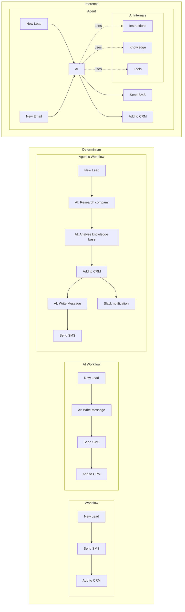

```mermaid
graph LR
    %% The AI Automation Spectrum

    %% ---------- Left side: Determinism ----------
    subgraph Determinism
    direction LR

        subgraph D_Workflow [Workflow]
        direction TB
            A1[New Lead] --> A2[Send SMS]
            A2 --> A3[Add to CRM]
        end

        subgraph D_AIWorkflow ["AI Workflow"]
        direction TB
            B1[New Lead] --> B2["AI: Write Message"]
            B2 --> B3[Send SMS]
            B3 --> B4[Add to CRM]
        end

        subgraph D_Agentic ["Agentic Workflow"]
        direction TB
            C1[New Lead] --> C2["AI: Research company"]
            C2 --> C3["AI: Analyze knowledge base"]
            C3 --> C4[Add to CRM]
            C4 --> C5["AI: Write Message"]
            C5 --> C6[Send SMS]
            C4 --> C7[Slack notification]
        end

    end

    %% ---------- Right side: Inference ----------
    subgraph Inference
    direction LR

        subgraph I_Agent [Agent]
        direction LR
            D1[New Lead] --> AG[AI]
            D2[New Email] --> AG

            %% Agent outputs
            AG --> E1[Send SMS]
            AG --> E2[Add to CRM]

            %% Agent internals (grouped but separate id from AG)
            subgraph I_AI_Internals ["AI Internals"]
            direction TB
                F1[Instructions]
                F2[Knowledge]
                F3[Tools]
            end

            %% Show AG "uses" its internals (non-cyclic)
            AG -.uses.-> F1
            AG -.uses.-> F2
            AG -.uses.-> F3
        end

    end
```

graph LR
    A[Your Input] -->|Paste| B[AI Processing]
    B -->|Extract| C[Proposals]
    C -->|Review| D[Your Approval]
    D -->|Execute| E[Files Updated]
    E -->|Track| F[Git Commit]