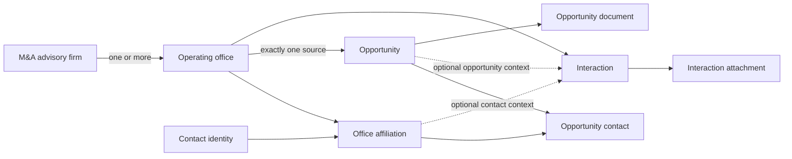

# WAVE M&A Data Model and Dictionary v1

## Contract status

| Item | Value |
| --- | --- |
| Status | Approved and live contract |
| Implementation status | Migrations 076 to 079 are live and schema-verified. Migration 080 is a checked-in W-062 implementation candidate only: it has not been applied to production. The canonical office/contact model, one-time cutover staging area and W-064 provisional Acme foundation are present; Acme is not assigned to any opportunity, review evidence and email reservations are empty, no real workbook has been imported, and Excel remains operationally authoritative until W-010. The W-010 date-precision and test-data replacement rules remain approved target gaps and must be implemented and production-verified before the real workbook is staged. |
| Contract owner | Ivan Paudice, CTO and product owner |
| Implementation owner | Dev team |
| Business reviewers | Bertrand and Colin when a real operating case needs confirmation |
| PDR scope | W-001, repreneur action and staff-verified transition authority; W-021, conditional source-identity disclosure; W-061, M&A office and contact identity foundation; W-062, M&A relationship history; W-063, canonical staff opportunity intake; W-064, provisional source foundation; W-065, staff review workflow; W-020, controlled one-time cutover staging; W-010, production activation and WAVE-only switch |
| Last reviewed against live Supabase | 2026-07-27 |
| Last reviewed against source workbook | 2026-07-26, `CRM Re-New for Wave.xlsx` |

This is the only human-readable source of truth for the M&A advisory data model. Supabase enforces the released implementation. This document defines the approved business meaning, target relationships, requiredness and visibility.

If the released database and this contract disagree, the difference must be made explicit. Do not silently change the document to describe an accidental implementation and do not call a target rule implemented until it is verified in the live database.

Any change to the M&A schema, business validation, visibility rule or import mapping must update this document in the same commit before release.

W-061 core scope is the firm, office, contact affiliation and opportunity source foundation. W-062 core scope is the office-anchored interaction history. Interaction attachments, discovery provenance and geography confidence are valid optional capabilities, but they do not block either core card unless the PDR explicitly brings them into scope.

The W-061 foundation deliberately does not add an opportunity sourcing channel. Ivan rejected that proposal. It also retires `opportunities.repreneur_exposure` from the target operating model: the legacy column remains only while old reads are migrated, and is not an active intake, import or disclosure control. Until those reads are removed, the W-061 service writes `staff_only` for every new record and every transition from or to `draft` as a compatibility firewall; it does not backfill or alter an already visible active record. W-063 is the staff application boundary for those rules: activation never publishes an opportunity.

## Requiredness language

| Label | Meaning |
| --- | --- |
| System | Generated and maintained by WAVE |
| Always | Required when the record is created |
| Valid opportunity | Required before an opportunity may leave `draft` and while it is `active` or `paused` |
| Repreneur visible | Required before an opportunity may be exposed to a repreneur |
| Conditional | Required only when the stated condition is true |
| Optional | May be absent without making the record invalid |

Database `NOT NULL` is not a substitute for this contract. A database field may remain nullable to support drafts or migration staging while still being required at a later business gate.

Closed and archived opportunities preserve the source and contact history that was valid when work occurred. They are not required to keep a currently active affiliation or usable current email.

## Model at a glance

The constant relationship chain is:

`M&A advisory firm → operating office → contacts, opportunities and interactions`

Every non-archived firm has at least one active office. A firm without a known branch structure receives one synthetic default office. A multi-office firm has no fallback office: staff must select the real office. Contacts may work across several offices through affiliations. Opportunities and interactions never attach directly to a firm.

`Network` is optional information on a firm. It is not a separate operational entity in version 1.

## 1. M&A advisory firm

**Purpose:** the stable identity of the M&A advisory business. It is not an office and it does not directly own contacts, opportunities or interactions.

**Target table:** `ma_firms`

| Attribute | Type or values | Requiredness | Visibility | Source of truth | Meaning and validation |
| --- | --- | --- | --- | --- | --- |
| `id` | UUID | System | Staff only | WAVE | Stable internal identity |
| `name` | Text | Always | Staff only | WAVE | Human-readable firm name; trimmed and non-empty |
| `status` | `prospect`, `active`, `archived` | Always | Staff only | WAVE | Defaults to `prospect`; archiving preserves history |
| `category` | Controlled text | Optional | Staff only | WAVE | Examples include M&A boutique, advisory bank and transaction advisory; taxonomy may evolve without changing relationships |
| `network_label` | Text | Optional | Staff only | WAVE | Informational grouping only; it cannot own contacts, opportunities, scoring or workflow |
| `website_url` | URL | Optional | Staff only | WAVE | Firm-level website |
| `discovery_channel` | Controlled text | Optional | Staff only | WAVE | How Re-New first identified the firm |
| `discovery_url` | URL | Optional | Staff only | WAVE | Evidence supporting the discovery channel |
| `discovered_at` | Date | Optional | Staff only | WAVE | Date the firm was added to the source dataset |
| `internal_notes` | Text | Optional | Staff only | WAVE | Relationship context; never exposed to repreneurs |
| `created_by`, `created_at` | Staff ID, timestamp | System | Staff only | WAVE | Creation audit |
| `updated_by`, `updated_at` | Staff ID, timestamp | System | Staff only | WAVE | Last change audit |
| `archived_by`, `archived_at` | Staff ID, timestamp | Conditional | Staff only | WAVE | Required when archived |

### Firm rules

1. Every non-archived firm has at least one active operating office.
2. Creating a firm without a known real office creates one synthetic default office with the same name.
3. A firm may exist as a prospect without contacts or opportunities.
4. A referenced firm is archived, never hard deleted.
5. A firm with an `active` or `paused` opportunity through any of its offices cannot be archived. Staff first closes, archives or moves those opportunities in the same transaction.
6. New firm identity intake creates the firm, its real or synthetic initial office, a named contact and an active affiliation atomically. A real office is used whenever one is known; a synthetic default is used only when it is not.
7. Canonical firm intake serializes on the lower-trimmed name and rejects an existing exact canonical match. It does not merge records automatically.
8. Firm name similarity may raise a duplicate warning but does not merge records automatically.

## 2. Operating office

**Purpose:** the exact operational location or unit through which Re-New manages contacts, opportunities and interactions.

**Target table:** `ma_offices`

| Attribute | Type or values | Requiredness | Visibility | Source of truth | Meaning and validation |
| --- | --- | --- | --- | --- | --- |
| `id` | UUID | System | Staff only | WAVE | Stable internal identity |
| `firm_id` | UUID | Always | Staff only | WAVE | Exactly one parent firm |
| `name` | Text | Always | Staff only | WAVE | Office name; default office may use the firm name |
| `status` | `active`, `archived` | Always | Staff only | WAVE | Defaults to `active` |
| `is_default` | Boolean | Always | Staff only | WAVE | `true` only for the synthetic office created when no real office is known |
| `city` | Text | Optional | Staff only | WAVE | Main office city |
| `address` | Text | Optional | Staff only | WAVE | Postal address when operationally useful |
| `region_codes` | List of controlled codes | Optional | Staff only | WAVE | Geographic coverage using the canonical WAVE geography taxonomy |
| `coverage_note` | Text | Optional | Staff only | WAVE | Free-text exception or national coverage note |
| `geography_confidence` | `confirmed`, `review` | Conditional | Staff only | WAVE | Used when imported geographic classification needs review |
| `website_url` | URL | Optional | Staff only | WAVE | Office-specific website |
| `general_email` | Email | Optional | Staff only | WAVE | Office mailbox; it is not a person and cannot be an opportunity primary contact |
| `general_phone` | Text | Optional | Staff only | WAVE | Office telephone |
| `internal_notes` | Text | Optional | Staff only | WAVE | Office-specific relationship context |
| `created_by`, `created_at` | Staff ID, timestamp | System | Staff only | WAVE | Creation audit |
| `updated_by`, `updated_at` | Staff ID, timestamp | System | Staff only | WAVE | Last change audit |
| `archived_by`, `archived_at` | Staff ID, timestamp | Conditional | Staff only | WAVE | Required when archived |

### Office rules

1. An office belongs to exactly one firm.
2. At most one synthetic default office may exist for a firm.
3. A multi-office firm has no automatic fallback. Staff must select the real office.
4. When a real active office becomes known, WAVE removes the synthetic default from intake selection and rejects it for new or changed opportunity source contexts. Historical links remain until staff resolves any active records.
5. An office with referenced contacts, opportunities or interactions is archived, never hard deleted.
6. Contacts, opportunities and interactions attach to an office, never directly to the firm.

## 3. Contact

**Purpose:** one stable WAVE identity for one person.

**Target table:** `ma_contacts`

| Attribute | Type or values | Requiredness | Visibility | Source of truth | Meaning and validation |
| --- | --- | --- | --- | --- | --- |
| `id` | UUID | System | Staff only | WAVE | Stable person identity |
| `first_name` | Text | Conditional | Staff only | WAVE | At least one of first name or last name is required |
| `last_name` | Text | Conditional | Staff only | WAVE | At least one of first name or last name is required |
| `display_name` | Text | System | Staff only | WAVE | Derived from the available name fields |
| `status` | `active`, `archived` | Always | Staff only | WAVE | Defaults to `active` |
| `email` | Email | Optional | Staff only | WAVE | Normalized for comparison; not globally unique |
| `phone` | Text | Optional | Staff only | WAVE | Normalized for search while preserving the entered display value |
| `linkedin_url` | URL | Optional | Staff only | WAVE | Person-level profile |
| `internal_notes` | Text | Optional | Staff only | WAVE | Person-level relationship context |
| `created_by`, `created_at` | Staff ID, timestamp | System | Staff only | WAVE | Creation audit |
| `updated_by`, `updated_at` | Staff ID, timestamp | System | Staff only | WAVE | Last change audit |
| `archived_by`, `archived_at` | Staff ID, timestamp | Conditional | Staff only | WAVE | Required when archived |

### Contact rules

1. A contact is a person, not a generic office mailbox.
2. An active contact has at least one active office affiliation.
3. The same contact may have several office affiliations without duplicating the person.
4. Email is not globally unique. Repeated email raises a warning for review but does not block a legitimate multi-office relationship.
5. A contact without a usable email may exist, but cannot be the primary contact of a valid opportunity.
6. A referenced contact is archived, never hard deleted.
7. Adding a second contact to an office, or affiliating an existing canonical contact to another office, uses the audited `create_or_affiliate_ma_contact` service. It creates no legacy contact or recurrent synchronization record.

## 4. Contact office affiliation

**Purpose:** identifies the exact office relationship through which a contact works.

**Target table:** `ma_contact_office_affiliations`

| Attribute | Type or values | Requiredness | Visibility | Source of truth | Meaning and validation |
| --- | --- | --- | --- | --- | --- |
| `id` | UUID | System | Staff only | WAVE | Stable relationship identity |
| `contact_id` | UUID | Always | Staff only | WAVE | One contact |
| `office_id` | UUID | Always | Staff only | WAVE | One operating office |
| `job_title` | Text | Optional | Staff only | WAVE | Role held at this office |
| `is_active` | Boolean | Always | Staff only | WAVE | Defaults to `true` |
| `started_at` | Date | Optional | Staff only | WAVE | Known relationship start |
| `ended_at` | Date | Conditional | Staff only | WAVE | Required when the affiliation becomes inactive |
| `created_by`, `created_at` | Staff ID, timestamp | System | Staff only | WAVE | Creation audit |
| `ended_by`, `updated_at` | Staff ID, timestamp | System | Staff only | WAVE | Change audit |

### Affiliation rules

1. Only one active affiliation may exist for the same contact and office pair.
2. Ending an affiliation preserves every opportunity and interaction that used it.
3. A contact may move offices by ending the old affiliation and creating or activating the new one.
4. An affiliation cannot be deleted while referenced.
5. An affiliation used by an `active` or `paused` opportunity may end only after staff links a replacement at the same office or closes or archives the opportunity.
6. If the ending affiliation is primary, staff must identify the replacement primary contact before operational work can continue.
7. The canonical contact-affiliation service rejects a duplicate active contact-and-office pair. If a person returns after an earlier affiliation ended, it creates a new active affiliation and retains the ended row as history.

### Canonical contact-affiliation write boundary

W-063 adds an additional person to an existing office, or links an existing canonical person to an additional office, through `create_or_affiliate_ma_contact`. It requires an actor and an active office beneath a non-archived firm. With `p_existing_contact_id`, it affiliates that active canonical contact and rejects contact profile fields; without it, it creates one named person from the supplied name fields. The staff action treats those modes as mutually exclusive: a new-person submission rejects every non-empty or non-string existing-contact ID value, and existing-person mode requires exactly one non-empty string UUID with no repeated contact-ID entries and no non-empty or repeated person-identity entries. `p_contact_job_title` belongs to the affiliation in either mode. The service returns `contact_id` and `affiliation_id`, rejects an already-active pair, and never creates or mutates `ma_source_contacts`, `opportunity_source_contacts` or a recurrent legacy sync record.

## 5. Opportunity

**Purpose:** one acquisition opportunity sourced through exactly one operating office.

**Target table:** `opportunities`, evolved additively from the current table.

| Attribute | Type or values | Requiredness | Visibility | Source of truth | Meaning and validation |
| --- | --- | --- | --- | --- | --- |
| `id` | UUID | System | Staff only | WAVE | Stable internal identity |
| `reference` | Text | Always | Staff and repreneur when visible | WAVE | Unique Re-New reference |
| `status` | `draft`, `active`, `paused`, `archived`, `closed` | Always | Role appropriate | WAVE | Defaults to `draft`; leaving draft activates validity rules |
| `source_office_id` | UUID | Valid opportunity | Staff only | WAVE | Exactly one source office |
| `location` | Text | Repreneur visible | Role appropriate | WAVE | Reader-facing location |
| `geography_code` | Controlled code | Optional | Staff only | WAVE | Canonical matching geography |
| `geography_confidence` | `confirmed`, `review` | Conditional | Staff only | WAVE | Required when imported geography needs review |
| `sector` | Controlled label | Repreneur visible | Role appropriate | WAVE | Reader-facing canonical sector |
| `sector_code` | Controlled code | Optional | Staff only | WAVE | Canonical matching sector |
| `sector_confidence` | `confirmed`, `review` | Conditional | Staff only | WAVE | Required when imported sector needs review |
| `description` | Text | Valid opportunity | Staff only | WAVE | Full internal opportunity description |
| `revenue_meur` | Numeric | Optional | Role appropriate | WAVE | Revenue in millions of euros; missing remains `null` |
| `ebitda_keur` | Numeric | Optional | Role appropriate | WAVE | EBITDA in thousands of euros; missing remains `null` |
| `headcount` | Integer | Optional | Role appropriate | WAVE | Exact headcount when known |
| `headcount_range` | Controlled text | Optional | Role appropriate | WAVE | Range when exact headcount is not known |
| `date_added` | Date | Optional | Staff only | WAVE | Source-reported or staff-entered opportunity date; it is not the WAVE creation timestamp |
| `date_added_precision` | `day`, `month` | Conditional | Staff only | WAVE | Required when `date_added` is present; preserves whether the source supplied a full calendar date or only month and year |
| `public_title` | Text | Repreneur visible | Repreneur when visible | WAVE | Anonymized reader-facing title |
| `teaser_summary` | Text | Repreneur visible | Repreneur when visible | WAVE | Approved anonymized summary |
| `internal_notes` | Text | Optional | Staff only | WAVE | Operational notes; never exposed |
| `created_by`, `created_at` | Staff ID, timestamp | System | Staff only | WAVE | Creation audit; `created_at` is when the WAVE record was created |
| `updated_by`, `updated_at` | Staff ID, timestamp | System | Staff only | WAVE | Last change audit |
| `archived_by`, `archived_at` | Staff ID, timestamp | Conditional | Staff only | WAVE | Required when archived |

### Opportunity rules

1. A draft may be incomplete.
2. An opportunity may leave `draft` only when it has a source office, description, at least one named contact, exactly one primary contact and a usable email for that primary contact.
3. Every active opportunity contact must use an active affiliation with the opportunity's source office.
4. Repreneur disclosure is a separate downstream decision. It additionally requires location, sector, public title, teaser summary, the relevant match or staff assignment, and the existing confidentiality gates.
5. Source firm, source office and named source contact remain staff only except for pursuit-scoped disclosure after both pursuit-specific signed copies remain valid, a Gate 2 pass is recorded and staff explicitly approves disclosure. Relationship history, source-review evidence, notes and audit metadata remain staff only at every stage.
6. Missing financial values remain `null`. Matching may apply a zero-equivalent only inside scoring and must flag incomplete inputs.
7. The source name shown in staff views is derived through the office and firm relationship. It is not stored as a second source relationship.
8. A positioned repreneur is represented by the existing match and pursuit objects, never by free text on the opportunity.
9. If an `active` or `paused` opportunity loses its usable primary contact email, WAVE blocks further operational mutations. Staff must correct the email, select another primary contact or close or archive the opportunity.
10. Closing or archiving an opportunity preserves its historical source office and contact links even when those contacts later move or become inactive. Canonical opportunity links capture contact snapshots at the time of linking; the migration 072/075 snapshots remain immutable compatibility evidence.
11. Staff create and edit use the atomic office-context services only. They do not write `source_id`, `source_label`, `opportunity_source_contacts`, `repreneur_exposure`, an origin channel or a separate source-contact relationship.
12. The atomic intake service cannot reopen a `closed` or `archived` opportunity. Reopening is a separate explicit workflow with its own audit and approval rules.
13. `date_added` and `date_added_precision` are both null when no source date is known. A known full calendar date uses precision `day`.
14. A source value containing only month and year is stored technically as the first day of that month with precision `month`. The artificial day must never be displayed, exported, described as an event day or used for day-level age or service-level reasoning.
15. A shared Acme provisional source context may be assigned only by staff. The stored fact is the existing canonical `source_office_id` link to Acme's office; “Source review required” is computed and is not a parallel stored review status. Acme may support `draft`, `active` and `paused` work while staff resolves the real source, but it cannot be used to close or archive an opportunity or to satisfy `cutover-ready` or `cutover-complete` treatment. Acme is never renamed into an actual intermediary; resolution changes the opportunity to the real office and retains the Acme assignment and reason in immutable correction evidence.

### Atomic intake write boundary

W-063 and W-020 save opportunity source context, contact selection, description, target status and optional intake fields through the audited `save_opportunity_office_context` and `create_opportunity_with_office_context` RPCs. Their final parameter is `p_opportunity_fields JSONB`, which accepts exactly:

`sector`, `activity`, `location`, `revenue_meur`, `ebitda_keur`, `headcount`, `headcount_range`, `date_added`, `public_title`, `teaser_summary`, and `internal_notes`.

An omitted key preserves the existing value; an explicit JSON `null` clears it. Numeric, integer and date values are parsed inside the same transaction, so a cast or validation failure rolls back source, contact, status and field changes together. The payload rejects unsupported keys and must never accept `source_id`, `source_label`, `source_office_id`, `repreneur_exposure`, `origin_channel`, `imported_from` or `imported_at`. Existing pre-076 `source_id` and `source_label` remain read-compatibility evidence only; the services neither populate nor reconcile them. Active and paused validity is defined by `source_office_id`.

Migration 076 explicitly revokes and drops any intermediate seven-argument opportunity save/create RPC overloads before it defines the final JSONB signatures. A rerun therefore cannot leave a granted pre-allowlist write path behind.

Before W-010 stages the real workbook, the additive date-precision release must extend the atomic write contract so `date_added` and `date_added_precision` are validated and written together. The current production RPC allowlist above does not yet accept the companion field and must not be used to normalize month/year-only values.

### W-065 staff source-review boundary

W-065 is a staff-only application boundary over the live W-064 evidence model. Opportunity detail and staff lists compute `Source review required` from the fixed provisional office plus unresolved append-only assignment evidence; the application returns only that boolean and never a provisional context ID, event, reason, actor, timestamp, or prior/current source snapshot. Staff resolves the review only through `resolve_acme_provisional_source`, supplying a different canonical office, active affiliations at that office, exactly one primary affiliation, and a reason. The RPC reuses `save_opportunity_office_context` inside the same transaction, retains immutable before/after evidence, preserves the opportunity UUID and history, serializes against an active source-email send, and blocks `closed` and `archived` records. The application adds no source-review field, schema migration, browser-role write path, repreneur projection, notification, export, or email action.

## 6. Opportunity contact

**Purpose:** links an opportunity to a contact through the exact office affiliation relevant to that opportunity.

**Target table:** `opportunity_ma_contacts`

| Attribute | Type or values | Requiredness | Visibility | Source of truth | Meaning and validation |
| --- | --- | --- | --- | --- | --- |
| `id` | UUID | System | Staff only | WAVE | Stable relationship identity |
| `opportunity_id` | UUID | Always | Staff only | WAVE | One opportunity |
| `affiliation_id` | UUID | Always | Staff only | WAVE | Exact contact and office relationship |
| `contact_name_snapshot`, `contact_email_snapshot`, `contact_phone_snapshot` | Text | System | Staff only | WAVE | Immutable contact attribution captured when the link is first created |
| `is_primary` | Boolean | Always | Staff only | WAVE | Exactly one active link is primary for a valid opportunity |
| `is_active` | Boolean | Always | Staff only | WAVE | Defaults to `true` |
| `linked_by`, `linked_at` | Staff ID, timestamp | System | Staff only | WAVE | Creation audit |
| `removed_by`, `removed_at` | Staff ID, timestamp | Conditional | Staff only | WAVE | Required when the link becomes inactive |

### Opportunity contact rules

1. The affiliation office must equal the opportunity source office.
2. A valid opportunity has one or more active contact links and exactly one primary.
3. The primary contact must be named and have a usable email.
4. Removing a contact link ends it. Historical attribution is preserved.
5. No role taxonomy beyond primary versus additional is introduced in version 1.

## 7. Interaction

**Purpose:** records the M&A relationship history before, during or after a specific opportunity.

**Target table:** `ma_interactions`

| Attribute | Type or values | Requiredness | Visibility | Source of truth | Meaning and validation |
| --- | --- | --- | --- | --- | --- |
| `id` | UUID | System | Staff only | WAVE | Stable interaction identity |
| `office_id` | UUID | Always | Staff only | WAVE | Exact operating office context |
| `affiliation_id` | UUID | Optional | Staff only | WAVE | Contact and office relationship when a person is involved |
| `opportunity_id` | UUID | Optional | Staff only | WAVE | Related opportunity; not required |
| `channel` | `call`, `email`, `meeting`, `document`, `other` | Always | Staff only | WAVE | Interaction type |
| `direction` | `inbound`, `outbound` | Conditional | Staff only | WAVE | Required for email and call; optional for other channels |
| `occurred_at` | Timestamp | Always | Staff only | WAVE | When the interaction happened |
| `owner_staff_user_id` | Staff ID | Always | Staff only | WAVE | Staff member responsible for the interaction |
| `owner_verification_state` | `provisional`, `verified` | Always | Staff only | WAVE | Migrated rows start `provisional` and visibly require the assigned owner to verify them; verification is an append-only staff action |
| `owner_verified_by`, `owner_verified_at` | Staff ID, timestamp | Conditional | Staff only | WAVE | Required only after the owner has verified their provisional assignment |
| `title` | Text | Optional | Staff only | WAVE | Short label or email subject |
| `summary` | Text | Conditional | Staff only | WAVE | Required unless at least one attachment or stored email body provides the evidence |
| `outcome` | Text | Optional | Staff only | WAVE | Result of the interaction |
| `next_action` | Text | Optional | Staff only | WAVE | Concrete follow-up |
| `next_action_due_at` | Timestamp | Conditional | Staff only | WAVE | Required when a dated next action is committed |
| `template_key` | Text | Conditional | Staff only | WAVE | Required only for an email created from a WAVE template |
| `recipient_email_snapshot` | Email | Conditional | Staff only | WAVE | Required for an outbound email; preserves what was actually used |
| `body_markdown` | Text | Optional | Staff only | WAVE | Stored email body or structured notes |
| `delivery_status` | `pending`, `sent`, `failed` | Conditional | Staff only | WAVE | Required for email delivery attempts |
| `client_operation_key` | UUID | Conditional | Staff only | WAVE | Stable browser/server operation identity for a new outbound email; reused after an HTTP response loss |
| `provider_idempotency_key` | Text | Conditional | Staff only | WAVE | Required for an email delivery attempt; the canonical interaction UUID is the provider idempotency key for new sends |
| `provider_request_fingerprint` | SHA-256 hex | Conditional | Staff only | WAVE | Required for a pending email and binds the exact sender, recipient, subject, HTML and text replay payload without duplicating that content |
| `provider_message_id` | Text | Conditional | Staff only | WAVE | Required when the provider explicitly accepts an email |
| `delivery_error` | Text | Conditional | Staff only | WAVE | Required when email delivery fails |
| `sent_at` | Timestamp | Conditional | Staff only | WAVE | Required when an email is sent |
| `delivery_finalized_at` | Timestamp | Conditional | Staff only | WAVE | Required when a pending email is explicitly finalized as sent or failed |
| `created_by`, `created_at` | Staff ID, timestamp | System | Staff only | WAVE | Creation audit |
| `updated_by`, `updated_at` | Staff ID, timestamp | System | Staff only | WAVE | Correction audit |

### Interaction rules

1. An interaction always belongs to an office.
2. A contact is optional. When present, its affiliation must belong to the same office.
3. An opportunity is optional. When present, its source office must equal the interaction office.
4. An interaction can exist before an opportunity.
5. Interactions are staff only and remain in chronological history.
6. A sent email preserves recipient, subject and body evidence even if the contact later changes email.
7. Corrections are audited. Interactions are not silently overwritten or hard deleted.
8. The four migrated historical email rows retain their legacy UUIDs, exact current source/office/contact/opportunity/recipient evidence and content evidence. Their owner is Bertrand's unique staff `app_user_roles.user_id`, marked `provisional` until Bertrand confirms it through the audited service-only verification action.
9. A new workflow email is persisted as `pending` through the narrow `begin_ma_interaction_email_send` service before the provider call. Its stable client operation key survives an HTTP response loss, its interaction UUID is the provider idempotency key, and its SHA-256 request fingerprint binds the exact provider payload. An explicit provider response is finalized once as `sent` with provider message ID or `failed` with error evidence through `finalize_ma_interaction_email_send`.
10. A thrown, provider `application_error`, provider internal error, conflicting idempotency response, unknown error or response without a provider message ID remains `pending`; it is never guessed to be sent or failed. The reservation may then be released because the linked pending interaction independently blocks a source-office change.
11. Reconciliation replays only the identical provider request with the same interaction and provider idempotency key, following the provider's cached-response contract. The existing send control reuses the client operation key across browser retries and reloads, while the server also deduplicates an identical opportunity/request fingerprint. Safe replay is limited to 23 hours; an older unresolved attempt remains pending for manual reconciliation and cannot create a new send.
12. Pending, sent and failed transitions are retained in append-only `ma_interaction_delivery_events`. Direct service-role table writes are revoked; new email sends and owner verification use only the narrow audited services.
13. An opportunity source office cannot change while its external-email reservation is active or when that change would invalidate linked interaction history.
14. New workflow email sends write only `ma_interactions` and their delivery events. `ma_source_interactions` is not a dual-write target after W-062.

## 8. Interaction attachment

**Purpose:** stores a document received, sent or discussed in an interaction that may exist without an opportunity.

**Target table:** `ma_interaction_attachments`

| Attribute | Type or values | Requiredness | Visibility | Source of truth | Meaning and validation |
| --- | --- | --- | --- | --- | --- |
| `id` | UUID | System | Staff only | WAVE | Stable attachment identity |
| `interaction_id` | UUID | Always | Staff only | WAVE | Parent interaction |
| `title` | Text | Always | Staff only | WAVE | Human-readable label |
| `storage_bucket` | Text | Always | Staff only | WAVE | Private storage bucket |
| `storage_path` | Text | Always | Staff only | WAVE | Private object path |
| `file_name` | Text | Always | Staff only | WAVE | Original display name |
| `mime_type` | Text | Optional | Staff only | WAVE | File content type |
| `size_bytes` | Integer | Optional | Staff only | WAVE | File size |
| `uploaded_by`, `uploaded_at` | Staff ID, timestamp | System | Staff only | WAVE | Upload audit |

### Attachment rules

1. Interaction attachments are staff only.
2. Linking an interaction to an opportunity does not expose its attachment to a repreneur.
3. A file becomes an opportunity document only through an explicit staff action and the opportunity document visibility rules.

## 9. Opportunity document

**Purpose:** stores deal documents associated with an opportunity and their controlled visibility.

**Target table:** `opportunity_documents`, retaining the current table.

| Attribute | Type or values | Requiredness | Visibility | Source of truth | Meaning and validation |
| --- | --- | --- | --- | --- | --- |
| `id` | UUID | System | Staff only | WAVE | Stable document identity |
| `opportunity_id` | UUID | Always | Staff only | WAVE | Parent opportunity |
| `title` | Text | Always | Role appropriate | WAVE | Human-readable title |
| `document_type` | `teaser`, `deal_book`, `nda`, `external_analysis`, `other` | Always | Role appropriate | WAVE | Controlled document category |
| `visibility` | `staff_only`, `approved_for_repreneur` | Always | Role appropriate | WAVE | Defaults to `staff_only`; existing confidentiality gates still apply |
| `storage_bucket` | Text | Always | Staff only | WAVE | Private storage bucket |
| `storage_path` | Text | Conditional | Staff only | WAVE | Required unless an external URL is used |
| `external_url` | URL | Conditional | Staff only | WAVE | Required unless a storage path is used |
| `file_name`, `mime_type`, `size_bytes` | Text, text, integer | Optional | Staff only | WAVE | File metadata |
| `uploaded_by`, `uploaded_at` | Staff ID, timestamp | System | Staff only | WAVE | Upload audit |
| `repreneur_approved_by`, `repreneur_approved_at` | Staff ID, timestamp | Conditional | Staff only | WAVE | Required when visibility becomes `approved_for_repreneur` |
| `updated_at` | Timestamp | System | Staff only | WAVE | Last metadata change |

### Opportunity document rules

1. A document defaults to `staff_only`.
2. `approved_for_repreneur` requires a recorded approving staff member and timestamp.
3. Delivery to a repreneur additionally requires the existing signed or explicitly waived NDA evidence. Visibility alone is never sufficient.
4. Browser roles never receive direct database or storage access to staff-only source and document records. Approved delivery uses the existing server-side confidentiality path.

## Cross-entity invariants

These rules are part of the contract and should be enforced in the database wherever practical:

1. Every non-archived firm has one or more active offices. A firm may have at most one synthetic default office. Once a real active office is known, that default is preserved only for historical attribution and cannot be selected for new or changed opportunity source contexts.
2. Contacts reach offices only through affiliations.
3. Opportunities and interactions always anchor to an office.
4. An opportunity contact links through an affiliation belonging to the opportunity source office.
5. A valid opportunity has at least one active contact and exactly one primary contact.
6. The primary contact of a valid opportunity is named and has a usable email.
7. An interaction's optional contact and opportunity must belong to the interaction office.
8. Referenced firms, offices, contacts and relationships are archived or end-dated, never hard deleted.
9. Every staff mutation records actor and timestamp.
10. Source relationships, interactions, audit metadata and internal notes are staff only, except for the tightly gated source-identity disclosure defined in the authority matrix below.
11. Excel identifiers never remain in live firm, office, contact or opportunity records.
12. A staff-only draft may have no source office or contacts. Moving to `active` or `paused` happens through the atomic office-context service and requires the full valid-opportunity rules. Activation never broadens repreneur disclosure; the legacy exposure field stays `staff_only` for new records and draft transitions until the old portal reads are removed.
13. An active or paused opportunity requires `source_office_id`; it does not require a legacy `source_id`.
14. Every migration 076 child foreign key that needs a standalone lookup has a full, leftmost index; a partial business index does not substitute for a parent-delete or update check.

## Repreneur visibility contract

| Data | Staff | Repreneur |
| --- | --- | --- |
| Firm, office and named contact identities | Yes | Only for an active pursuit after both valid pursuit-specific signed copies, a recorded Gate 2 pass and an explicit staff disclosure approval; access is revoked on NDA expiry, staff revocation or pursuit closure |
| Firm, office and contact notes | Yes | Never |
| Interaction history, source-review evidence and audit metadata | Yes | Never |
| Opportunity internal description and notes | Yes | Never |
| Opportunity public title, teaser, sector, location and approved metrics | Yes | Only when the opportunity visibility and confidentiality gates allow it |
| Opportunity documents | Yes | Only when explicitly approved and the NDA gate allows it |
| Cutover mappings and issues | Yes | Never |

No API, export, notification, download or UI surface may expose staff-only source information to a repreneur. The one exception is the approved source firm, office and named contact disclosure in the table above; it must be server-side, purpose-limited to that active pursuit and revoked immediately when any listed condition ceases to hold.

## Lifecycle action and evidence authority matrix

This is the authoritative W-001 operating contract for supported lifecycle actions. It defines business authority without adding a second workflow, a parallel status field or a speculative interface. “Staff” means an authenticated Re-New staff member acting through the applicable staff-only boundary; “repreneur” means the positioned repreneur through the existing portal path. Every “immutable event” below is append-only evidence: it retains actor, timestamp, object IDs, prior and resulting state where relevant, and the decision or evidence reference. Existing record fields remain the source of truth; dashboard labels are computed from those fields and the referenced evidence.

| Action | Initiating actor and preconditions | Stored facts vs computed labels | Evidence and staff validation | Resulting visibility | Retention and immutable audit event |
| --- | --- | --- | --- | --- | --- |
| Assign provisional Acme source context | Staff; opportunity is `draft`, `active` or `paused`; Acme firm, office and named contact use the canonical office/contact chain | Store the existing canonical `source_office_id` link to Acme's office and canonical contacts; “Source review required” is computed, never stored as a parallel review status | Staff records why the real source is unavailable; no repreneur action can validate it | Staff only | Append the Acme assignment and reason as immutable evidence; retain it after later resolution |
| Resolve or correct provisional source | Staff; opportunity is not `closed` or `archived`; real canonical office and valid contacts are known | Replace only the canonical source office/contact links; “Source review required” clears only when the recorded resolution passes validation | Staff validates office and contact affiliation through the existing atomic office-context boundary | Staff only | Retain the prior Acme/other source, assignment reason, new source, actor and time in immutable correction evidence; never recreate the opportunity |
| Change source office | Staff; opportunity is not `closed` or `archived`; replacement office and contacts satisfy the existing office-context rules | Store the changed canonical links; source name remains derived through office to firm, never duplicated | Staff validates the active affiliation, primary-contact and email rules when the opportunity is `active` or `paused` | Staff only | Retain before/after office and contact snapshots; append immutable correction event |
| Mutual-interest validation | Repreneur records their own response; staff records and validates the intermediary/counterparty response with reliable evidence for the same match/pursuit | Store each party's existing response and evidence reference; “Mutual interest” is computed only from the validated response pair | Only the validated response pair creates a distinct mutual-interest-validation immutable event; only that event may trigger E4 | Staff only until the existing downstream disclosure gates permit otherwise | Retain both responses, evidence and the distinct validation event |
| E4 — qualification and blank-NDA request | System/staff; E4 fires once for each distinct mutual-interest-validation event | Store the E4 transition, delivery result and idempotency reference scoped to that validation event; “E4 sent” is computed | A retry of the same validation event deduplicates. A later distinct validation creates its own E4 and qualification request; it requests the opportunity-level blank NDA only if absent at that later event. Delivery evidence and idempotency are mandatory. | Staff only | Retain each validation and delivery result; append E4 transition event without duplicate requests for the same validation event |
| Intermediary qualification | Staff/intermediary; E4 requested it for the positioned repreneur and source office/contact are known or explicitly provisional | Store qualification decision, subject repreneur and evidence reference in the existing relationship workflow; “Qualified for this repreneur” is computed | Staff validates the operating basis; unresolved Acme status remains visible to staff | Staff only | Retain decision, basis and actor; append qualification event |
| Blank NDA handling | Staff/intermediary; E4 requests it only when the opportunity does not already hold a valid opportunity-level blank NDA | Store the existing blank-NDA document/evidence reference and its opportunity linkage; “Blank NDA available” is computed | Staff validates document type, opportunity linkage and validity | Staff only | Retain document metadata and event. Blank-NDA reuse never reuses intermediary qualification or Gate 1 staff access approval. |
| Gate 1 | Staff; the intermediary qualification for that repreneur is validated and a valid opportunity-level blank NDA exists | Store Gate 1 access-validation decision, actor, time and evidence reference; “Gate 1 passed” is computed | Staff validation of access is mandatory. Blank-NDA reuse never reuses qualification or staff approval. | Staff only | Retain decision and evidence; append Gate 1 event |
| E6 — repreneur NDA-ready notice | Staff/system; staff Gate 1 passed for the active pursuit | Store E6 delivery evidence, idempotency reference and time; “NDA ready to sign” is computed | Send E6 to the repreneur after Gate 1, stating that the NDA is ready to sign. E6 does not create or validate either pursuit-specific signed copy. | Repreneur sees the NDA-ready request only through the existing confidentiality path; source identity remains staff only | Retain delivery result and idempotency evidence; append E6 event |
| Re-New-signed pursuit copy | Staff; the pursuit-specific NDA copy is prepared after the approved E6 path | Store the signed-copy evidence, Re-New signer and received/signed time; “Re-New copy validated” is computed | Staff validates signer, document linkage, pursuit specificity and validity. This is distinct from E6. | Staff only | Retain signed copy and validation outcome; append Re-New signed-copy event |
| Repreneur-signed pursuit copy | Repreneur submits through the existing confidentiality path after E6 | Store signed-copy evidence, signer and received time; “Repreneur copy validated” is computed | Staff validates signer, document linkage, pursuit specificity and validity. This is distinct from E6. | Staff only until Gate 2 and explicit disclosure approval also pass | Retain signed copy and validation outcome; append repreneur signed-copy receipt event |
| Gate 2 | Staff; the pursuit is active and both pursuit-specific signed copies have been validated | Store Gate 2 decision, actor, time and evidence reference; “Gate 2 passed” is computed | Staff validates both copies and their linkage. Gate 2 requires two validated pursuit-specific signed copies. | Staff only; Gate 2 alone does not disclose source identity | Retain decision and evidence; append Gate 2 event |
| Source identity disclosure approval | Staff; pursuit is active, both pursuit-specific signed copies remain valid, a `Gate 2 passed` event is recorded, and staff approval is explicit | Store explicit staff approval, scope and time; “Source identity visible” is computed from approval plus live signed copies, recorded Gate 2 and pursuit status | Staff validation is mandatory; no inferred approval is allowed | Repreneur may see only source firm, office and named contact for that pursuit | Retain approval and scope; append disclosure-approval event |
| Expiry or revocation of source disclosure | System detects NDA expiry or pursuit closure, or staff revokes; a prior disclosure approval exists | Store expiry/revocation or closure fact; “Source identity visible” becomes false immediately | Staff validates manual revocation; system enforces expiry/closure | Source identity is removed from repreneur surfaces; audit/history stay staff only | Retain cause, actor where applicable and time; append disclosure-revocation event |
| E7 — intermediary copies and memo request | Staff/system; both pursuit-specific signed copies exist and an already recorded `Gate 2 passed` event remains valid | Store E7 delivery evidence, both-copy references and memo-request reference; “E7 sent” is computed | E7 sends to the intermediary, transmits or references both signed pursuit copies, and requests the information memo. Delivery evidence and idempotency are mandatory. | Staff only unless a separately approved item is repreneur-visible | Retain delivery/reference evidence; append E7 transition event |
| Memo upload | Staff; opportunity and pursuit are correctly linked | Store the existing memo document metadata and staff-only default visibility; “Memo uploaded” is computed | Staff validates file type, linkage and confidentiality classification | Staff only by default | Retain document metadata and upload evidence; append memo-upload event |
| Memo approval for repreneur | Staff; memo exists and the existing document and NDA gates pass | Store approver, time and approved document visibility; “Memo available” is computed | Staff validation is mandatory; document visibility alone is insufficient | Repreneur sees only the approved memo through the server-side path | Retain approval and delivery evidence; append memo-approval event |
| E8 — memo-enabled final workflow step | Staff/system; staff Gate 2 passed and an actual approved memo is linked to the pursuit | Store the existing E8 state/evidence reference; “E8 complete” is computed | E8 requires both a passed staff Gate 2 and an actual approved memo; neither condition alone may fire E8. Staff validates the memo approval and completion evidence. | Role-appropriate; it does not widen source access by itself | Retain evidence; append E8 transition event |
| Repreneur interest or decline | Repreneur; an eligible proposed/active portal item exists | Store the existing response, selected decline reason and optional context; “Interested” or “Declined” is computed | Staff reviews only when the existing workflow requires escalation; no source data is added to the response | Repreneur sees own response; staff sees response and analysis | Retain response and context under existing record retention; append response event |
| Staff-recorded external decision | Staff; external outcome has a reliable source or delivery reference | Store decision, effective time, source/evidence reference and actor; summary labels are computed | Staff validation is mandatory | Staff only unless an existing role-specific workflow exposes its consequence | Retain evidence and decision; append external-decision event |
| Pause opportunity or pursuit | Staff; a valid operational reason is recorded | Store existing paused status and reason/evidence reference; “Paused” is computed | Staff validation is mandatory for externally consequential pauses | Staff only; existing repreneur surface follows its separate visibility rule | Retain reason and prior state; append pause event |
| Close opportunity | Staff; no unresolved provisional Acme source context and existing opportunity-closure prerequisites pass | Store existing opportunity closed status, reason, actor and time; “Closed” is computed | Staff validation is mandatory; an Acme-linked opportunity cannot close | Staff only | Preserve historical source/contact links and evidence; append opportunity-closure event |
| Close pursuit | Staff; existing pursuit-closure prerequisites pass; an unresolved Acme source does not block this action | Store existing pursuit closed status, reason, actor and time; “Pursuit closed” is computed | Staff validation is mandatory; closure immediately revokes any source-identity disclosure | Staff only; source identity is removed immediately | Retain pursuit closure reason, prior disclosure scope and revocation evidence; append pursuit-closure event |
| Reopen opportunity or pursuit | Staff; separately approved audited reopen workflow and documented reason exist | Store reopened state only through that explicit workflow; “Reopened” is computed | Staff validation and explicit approval are mandatory; generic intake cannot reopen | Staff only until all normal visibility gates are re-earned | Preserve the closed state and reason; append reopen event |
| Archive opportunity | Staff; existing archive rules pass and no unresolved provisional Acme source context remains | Store existing archive status, actor and time; “Archived” is computed | Staff validation is mandatory; an Acme-linked opportunity cannot archive | Staff only; any source disclosure is revoked | Preserve historical source/contact links and evidence; append archive event |
| Cutover-ready or cutover-complete treatment | Staff/system only; all W-010 evidence gates pass and no unresolved provisional Acme source context remains | Store only the existing cutover manifest, approvals and activation facts; readiness/completion labels are computed | Required W-010 staff, reconciliation and activation validation applies | Staff only | Retain sanitized manifest and immutable approval digest; Acme exception remains a blocker and is audited |

### Authority and implementation boundaries

1. This matrix is the approved business authority for W-001. It does not itself create a new table, status, document type, portal surface, migration or bypass around existing atomic write and confidentiality boundaries.
2. Required means the action must not proceed without the stated fact or evidence. Conditional means it is required only when its stated condition applies. Optional context never substitutes for a required gate.
3. Staff owns every source assignment, correction, office change, disclosure approval, Gate 1/Gate 2 decision, external decision, pause, closure, archive and reopen approval. A repreneur may initiate only their own interest/decline and signed-copy submission through existing portal flows.
4. The shared Acme firm is a provisional operational source, not test data and not a future name for an actual intermediary. It may support active work while review is unresolved, but it cannot become permanent closed, archived or cutover-complete history.
5. Source firm, office and named contact are staff-only before the exact disclosure conditions above. Source-review metadata, correction evidence, audit metadata and M&A relationship history are always staff-only.
6. W-001 requires no data migration: it canonicalizes authority and acceptance criteria. A future implementation must reuse an existing audited evidence path or, if none exists, add an additive migration before that implementation release. It must document the mapping here and update its migration, API, role projection and tests; it must not invent parallel fields.
7. W-001 has no standalone roadmap entry because it is an internal authority contract, not a new live user capability. Roadmap communication belongs to a later verified user-facing release that implements a matrix-governed capability.

## Source workbook mapping

The cutover mapper uses the workbook structure as input. The workbook does not define the WAVE architecture.

### One-time cutover rules

1. Excel remains operationally authoritative until Ivan announces the production switch. WAVE data remains test data until then.
2. There is one production cutover import. Before approval, a revised workbook may replace the pending stage rows in the same run; it does not create a recurring sync. Once approved, a revision must use the controlled supersession path, which retains the sanitized manifest but purges every temporary row and issue before closing that run.
3. Source rows and temporary mappings are staged outside the live domain tables in `ma_cutover_runs`, `ma_cutover_stage_rows` and `ma_cutover_stage_issues`. Missing or conflicting information is never invented. Every staged firm, office, contact and affiliation has an explicit reviewed resolution: `create`, or `reuse` with its reviewed canonical WAVE ID. A matching name, email or office never auto-reuses a live record.
4. An incomplete opportunity remains an import exception until it has a source office, description, named primary contact and usable primary email.
   Its full selected affiliation set is retained, every selected affiliation must belong to that source office, and the primary affiliation must be one of the selected affiliations.
5. Duplicate candidates are reviewed before activation. Missing financial values remain `null`.
6. Approval is refused while any blocker is unresolved. A service-role-only, security-invoker activation locks the approved run, all staged rows and all issues, recomputes its database-owned immutable approval digest, compares it with the stored and supplied values, requires zero unresolved blockers, creates a dependency-closed canonical firm, office, contact, affiliation and opportunity set, verifies the W-061 operational-validity rules, records aggregate results, then purges temporary rows and issues in the same transaction. Any error rolls back and leaves staging intact.
7. After row counts and relationships reconcile and Ivan approves the migration, temporary rows and every source workbook ID are deleted. The same temporary evidence is purged when a run is superseded. Live records retain only WAVE IDs.
8. Keep a cutover manifest with a required lowercase SHA-256 raw-content source hash, a non-identifying `sha256:<64 lowercase hex>` source fingerprint, execution and approval times, responsible staff member, sanitized aggregate record totals, allowlisted review decisions and an immutable approval digest. PostgreSQL recomputes that digest from the ordered staged rows and issues plus the source hash/fingerprint, reconciliation and review decisions; a caller-supplied value can only be compared, never define the approval. The manifest retains no raw workbook bytes, file names, workbook IDs or Excel identifiers. It is migration evidence, not another business entity or recurring import system.
9. Before replacing any live test opportunity or match, create an immutable backup and a separate replacement manifest containing its exact WAVE ID, object type and count. Only manifest-confirmed test records may be replaced or deleted. An ambiguous or real record blocks the run.
10. Preserve raw source date text, parsed `date_added`, `date_added_precision` and the parsing decision in temporary staging and bind them into the approval digest. Reconcile source, `day`, `month`, null and parse-failure counts before activation. The 144 known month/year-only values are valid non-blocking inputs when represented with precision `month`; a precision mismatch is a blocker.
11. Activation requires Colin's final-source and freeze confirmation, zero unresolved blockers, an attached replacement manifest and a passing staff workflow smoke test. Ivan's standing approval recorded on W-010 applies only when all four conditions are evidenced; otherwise the run stops.
12. A cell containing several email addresses is never imported as one address:
   1. If the addresses belong to one named person, staff verifies one usable primary email. Other addresses remain in the cutover resolution note unless a future contact-method model is approved.
   2. If the addresses belong to different people, split them into separate contacts.
   3. If ownership is unclear or an address is malformed, keep the row as an exception.

### W-020 cutover-rehearsal boundary

Migration 078 is a live but empty cutover foundation, not an import launch. It adds staff-only staging and a service-role-only activation primitive; no browser role receives table or function access. The `/opportunities/import` route is staff-gated and displays a deterministic in-repository synthetic rehearsal only. It accepts no workbook, file, pasted CSV/TSV/JSON rows or other production input, has no direct database write, and exposes no activation server action.

The approval digest is owned and recomputed by PostgreSQL with `pgcrypto` SHA-256 over a canonical, ordered serialization of the manifest, every staged row and every staged issue. It includes the algorithm-tagged source fingerprint, exact lowercase raw-content SHA-256 source hash, sanitized reconciliation summary and structured review decisions; the stored and activation-supplied digests must match that recomputation. An issue resolution timestamp is serialized as UTC-stable epoch microseconds, never a session-time-zone-dependent timestamp string. `review_decisions.approved_opportunity_fields` is the only optional-field authorization and may contain only `sector`, `activity`, `location`, `revenue_meur`, `ebitda_keur`, `headcount`, `headcount_range`, `date_added`, `public_title`, `teaser_summary`, and `internal_notes`. Each field must be both explicitly staged and approved. A missing metric or date remains `null`; an invalid supplied metric or date is a blocker, and approval as well as activation rejects unresolved blockers.

That paragraph describes the production-verified W-020 foundation. Before the real workbook is staged, an additive W-010 release must incorporate the derived `date_added_precision`, raw date parsing decision and exact test-data replacement manifest into the database-owned digest and activation checks. Documentation approval alone does not make those controls live.

The source fingerprint must be exactly `sha256:<64 lowercase hexadecimal characters>` and must be computed before staging from a non-retained provenance representation; a literal filename, workbook ID or source identifier is invalid. The source hash is the separate raw-content SHA-256 checksum. Stage temporary IDs and relationship keys are bounded tokens; locators are bounded flat objects with only source workbook/sheet/row/key fields; and payloads are bounded flat objects whose keys are allowlisted by entity type. This prevents raw workbook blobs, arbitrary nested JSON and unbounded identifiers from being parked in staging. A stage issue that names a row uses the same-run composite foreign key, so it cannot point at a row belonging to another run; a null row reference remains valid for a run-level issue. The retained manifest keeps only the fingerprint/hash, actor and time fields, sanitized aggregate reconciliation, allowlisted review decisions, immutable digest and sanitized aggregate result. Stage locators, normalized payloads, temporary IDs and issues are temporary evidence only and are purged after activation or controlled supersession.

Service role is trusted to create, revise and review pre-approval staging. A run must start open with no approval, activation or supersession evidence; service role cannot delete a run manifest, transition a run into `activating` or `activated`, or purge approved staging through the browser-facing/PostgREST path. Those lifecycle changes require the transaction-local activation guard created by the security-invoker activation function. The `pg_temp` guard is an application boundary for PostgREST callers, not a barrier to a principal that can execute arbitrary raw SQL with service-role database credentials and create a matching temporary table; raw SQL credential governance is outside this W-020 control. Pre-approval stage rows may be deleted and replaced for a revised workbook. An approved run is immutable; `supersede_ma_cutover_run` is the separate controlled close path that purges its temporary evidence, records a supersession actor and time, and retains the sanitized immutable manifest.

Gate 2 must execute migration 078 in a disposable Supabase-compatible PostgreSQL database before release. It must prove `extensions.digest('ma-cutover-gate2', 'sha256')` is available; calculate a digest with the same resolved issue under at least UTC and Europe/Rome session time zones and prove equality; reject a filename-like source fingerprint; reject a same-run mismatch between an issue and stage row while accepting a null stage-row reference; exercise digest mismatch and direct lifecycle/delete rejections; confirm approval rejects an unresolved blocker; confirm a pre-approval row can be replaced; and confirm activation/supersession purge only temporary stage rows and issues. It must also run a concurrent stage-mutation and supersession attempt to demonstrate the existing shared row-lock order serializes safely without deadlock or a partial purge; this remains a runtime check rather than an unproven static lock redesign.

Staged geography retains only its source label and an explicit `confirmed`, `review` or `null` decision. WAVE does not infer a geography code in this scope. The existing `opportunities.location` text may be written only when both the manifest and that staged value explicitly approve it; otherwise it remains `null`. Cutover never makes an opportunity repreneur-visible.

Every staged office also declares the boolean `isSyntheticDefault`. `true` means the W-061 synthetic fallback only: its staged name must equal the firm name and the firm must have no active real office. It is never a generic preferred office. An unknown office at a firm with real offices remains a review blocker until staff identifies the actual office or explicitly resolves the exception.

### Firm and office rows

| Source meaning | WAVE target | Rule |
| --- | --- | --- |
| Firm and office worksheet, column A | Temporary source row ID | Maps each source row during cutover only; delete after approval |
| Firm and office worksheet, parent ID column | Temporary parent mapping | Resolves the source row to its parent firm; delete after approval |
| Firm and office worksheet, level column | Cutover classification | Distinguishes firm and office rows; do not retain it as a second hierarchy |
| Firm or office name | `ma_firms.name` or `ma_offices.name` | Parent and level columns determine the split during staging |
| `isSyntheticDefault` | `ma_offices.is_default` | Required explicit boolean; `true` only for an unknown-office fallback named after the firm, and never where an active real office exists |
| Duplicate candidate | Staged `create` or `reuse` resolution | A reviewer binds a reuse to the canonical ID; matching text alone never merges records |
| Optional network label | `ma_firms.network_label` | Informational only |
| Firm category | `ma_firms.category` | Optional controlled value |
| Region and geography confidence | `ma_offices.region_codes`, `geography_confidence` | Review non-confirmed values |
| Website | Firm or office website | Use the most specific valid level |
| Discovery source, evidence link and date | Firm provenance fields | Optional; never a cutover blocker |

### Contact rows

| Source meaning | WAVE target | Rule |
| --- | --- | --- |
| Contacts worksheet, column A | Temporary source office ID | Maps to `office_id` during cutover only; delete after approval |
| First and last name | `ma_contacts` | At least one name component required |
| Job title | Affiliation `job_title` | Office-specific |
| Managed offices | Additional affiliations | Split and validate each office |
| Duplicate candidate | Staged `create` or `reuse` resolution | A reviewer binds a reuse to the canonical ID; matching name or email alone never merges a person |
| Email, phone and LinkedIn | `ma_contacts` | Email is not globally unique; apply the multi-email exception rules above |
| Repeated firm website and region | Derived from office | Do not duplicate on the contact |

### Opportunity rows

| Source meaning | WAVE target | Rule |
| --- | --- | --- |
| Mandate reference | `opportunities.reference` | Required and unique |
| Opportunities worksheet, column B | Temporary source office ID | Maps to `source_office_id`; required before activation and deleted after cutover |
| Source name | Validation evidence | Do not retain a duplicate source relationship |
| Location and source geography label | `opportunities.location` plus temporary geography decision | Write location only when the staged value and manifest both approve it; retain only source label plus `confirmed`, `review` or `null` during cutover; do not infer a code |
| Sector and activity | `opportunities.sector`, `activity` | Write only when explicitly staged and included in the approved manifest allowlist |
| Description | `opportunities.description` | Required before activation |
| Revenue, EBITDA, headcount and range | Opportunity metrics | Write only when explicitly staged and approved; missing remains `null`, while an invalid supplied value blocks activation |
| Date added | `opportunities.date_added`, `opportunities.date_added_precision` | A full date maps to precision `day`; month/year maps to the first of that month plus precision `month`. Both values must be staged, digest-bound and activated together; missing remains `null`, while invalid or mismatched precision blocks activation |
| Platform title and teaser | `opportunities.public_title`, `teaser_summary` | Write only when explicitly staged and approved; this does not make it repreneur-visible |
| Positioned repreneur | Existing match or pursuit | Never store as free text on the opportunity |
| Associated contact email | Temporary contact matching evidence | Convert to an affiliation and opportunity contact; do not retain as the relationship |
| Notes | `opportunities.internal_notes` | Staff only; write only when explicitly staged and approved |

## Current implementation reconciliation

Verified against the live Supabase schema through migrations 076 to 078 on 2026-07-26. Migrations 076 to 078 were applied to production and schema-verified on 2026-07-26. Production contains the canonical firm, office, contact, affiliation and opportunity-contact model; the legacy M&A objects are read-only compatibility evidence. The cutover manifest and staging boundary are live but empty, and no real workbook activation has occurred.

Gate 2 executed the final 076 to 078 sequence on 2026-07-26 in a disposable Supabase-compatible project whose six-table pre-076 M&A baseline was compared with the live schema catalog before any synthetic row was added. Runtime verification covered fail-closed invalid legacy data, current and historical contact bridging, email-only legacy retention, canonical and cutover privileges, lifecycle and digest rejection, two-contact activation with one primary, UTC/Rome digest equality, normalized-firm concurrency, stage-mutation and supersession serialization, transactional rollback and temporary-evidence purge. Gate 2 exposed and corrected an invalid legacy-affiliation backfill join in migration 076 and ambiguous activation-local identifiers in migration 078.

Production application on 2026-07-26 preserved 21 legacy source firms as 21 canonical firms and offices, 20 named contacts and affiliations, and 18 valid active opportunity-contact relationships with exactly one primary each. One test opportunity that had no named source contact was explicitly returned to `draft` and `staff_only` before migration; its two match records were preserved. Post-migration checks found no active opportunity without a source office, no active office mismatch, no temporary cutover rows, no legacy service-role write grant, and no anonymous or authenticated canonical-table access.

### Reproducible verification

Run `scripts/verify-ma-data-model-schema.sql` through the configured read-only Supabase connection against production project `iiuqcdnmxhtyispnykgf` before changing this section. The script performs these checks:

1. Read `information_schema.columns` for legacy and target M&A objects, including `ma_firms`, `ma_offices`, `ma_contacts`, `ma_contact_office_affiliations`, `opportunity_ma_contacts`, `ma_sources`, `ma_source_contacts`, `opportunity_source_contacts` and `opportunity_documents`.
2. Read `pg_constraint` for their primary, foreign-key, unique and check constraints.
3. Read `pg_indexes` for their unique and partial indexes.
4. Compare the result with checked-in migrations, TypeScript types and this target contract.
5. Record the verification date above only after all four checks.

| Current live and checked-in object | Current behavior | Target disposition | Status |
| --- | --- | --- | --- |
| `ma_sources` | Interim firm-level source record. Embedded contact fields are deprecated compatibility fields after migration 072 | Retain as a read-compatibility bridge for existing records only; do not create it as a condition of new opportunity activation | Live, service-role read-only compatibility bridge |
| `ma_firms`, `ma_offices` | Canonical firm and operating-office model live since migration 076 | Backfilled one synthetic default office per legacy source and preserve `ma_sources` only as compatibility evidence | Live and production-verified |
| `ma_contacts`, `ma_contact_office_affiliations` | Canonical people and current/historical office affiliations live since migration 076 | A legacy email-only or phone-only row stays only in the bridge until staff supplies a name | Live and production-verified |
| `opportunity_ma_contacts` | Canonical office-affiliation opportunity links live since migration 076 | Snapshot contact attribution and retain `opportunity_source_contacts` for existing history | Live and production-verified |
| `ma_cutover_runs`, `ma_cutover_stage_rows`, `ma_cutover_stage_issues` | Live, service-role-only one-time cutover boundary; all three tables were empty after release | The retained run manifest holds constrained source fingerprint/hash, sanitized aggregate reconciliation, allowlisted decisions, actor/times and immutable approval digest; temporary identifiers and rows are purged after successful activation or controlled supersession | Live and empty; no real workbook imported |
| `ma_provisional_source_contexts`, `ma_provisional_source_review_events`, `ma_source_email_send_reservations` | Migration 079 provisions exactly one shared Acme Co. / Acme Paris context with Bertrand's existing canonical contact, plus immutable assignment/resolution snapshots, database guards on the complete fixed identity chain, and a content-free two-minute external-send reservation | Keep Acme as provisional operational context only. Compute review-required from canonical source office plus unresolved append-only evidence; block opportunity close/archive, existing external intermediary email, and cutover approval/activation until resolution. The email action performs the required review RPC, then reserves the opportunity row across context load, canonical pending evidence, provider delivery and finalization so a concurrent assignment/resolution cannot change the source between check and send. Explicit success or failure releases the reservation after finalization; an ambiguous provider outcome remains pending and blocks retry for reconciliation. The fixed Bertrand guard checks the supplied display name and independently derives the effective display name from normalized first/last-name components, so it remains authoritative for display-only writes and regardless of migration 076 trigger firing order. Acme assignment and cutover readiness share one transaction lock; approved/activating runs block a new assignment, while an activated historical run does not permanently disable later ordinary Acme use. W-065 provides a staff-only banner, list badge/filter and resolver form that uses only the existing service-only primitive and projects only a computed boolean. | W-064 and W-065 live and production-verified on 2026-07-27; zero browser-role source-review exposure |
| `opportunities.date_added_precision` | No companion precision field exists, so a first-of-month normalization would appear to be an exact source date | Add the controlled `day` or `month` field; update atomic writes, staging, digest, role-specific projections, display, exports and tests together | Approved target gap; blocks W-010 workbook staging |
| W-010 test-data replacement manifest | The live W-020 cutover manifest does not inventory or back up existing production test opportunities and matches | Add an immutable backup plus an exact ID, object-type and count manifest before any replacement or deletion | Approved target gap; blocks W-010 activation |
| `ma_source_networks` | Migration 074 created an optional grouping object for legacy firms | Keep it as read-only compatibility grouping. It cannot own workflow, scoring, reporting, contacts or opportunities; canonical firms use optional `network_label` | Legacy read-only compatibility bridge; canonical `network_label` live |
| `ma_source_contacts` | Migration 072 supports several contacts per firm-level source; migration 075 allows a contact record to move between sources | Retain as read-only legacy evidence; canonical identity plus office affiliations own new relationships | Live, service-role read-only compatibility bridge |
| `ma_source_contact_moves` | Migration 075 keeps append-only old and new source and contact details | Preserve the audit while canonical office affiliation history owns current relationships | Live, service-role read-only compatibility evidence; W-062 still owns interaction history |
| `opportunities.source_id` | Nullable firm-level compatibility bridge | Migration 076 retired the live-source requirement in favour of `source_office_id`. Existing pre-076 values remain compatibility evidence, but canonical services do not populate or reconcile them. The atomic service enforces source office, description, named primary contact and usable email for `active` and `paused` opportunities | Canonical `source_office_id` live and production-verified |
| `opportunity_source_contacts` | Migrations 072 and 075 support several contacts, at most one primary, source consistency and immutable contact snapshots after moves | Preserve as immutable compatibility history while `opportunity_ma_contacts` links through office affiliations and snapshots future links | Live, service-role read-only compatibility bridge |
| `ma_source_interactions` | Four legacy email rows, retained after W-062 only as service-role read-only evidence | No new writes; canonical `ma_interactions` is office required with optional affiliation and opportunity | W-062 implementation candidate; production migration remains unapplied |
| `ma_interactions`, `ma_interaction_owner_verification_events`, `ma_interaction_delivery_events`, `ma_interaction_legacy_migration_manifest` | Migration 080 candidate creates staff-only canonical history, append-only owner and delivery evidence, controlled begin/finalize/owner-verification services, and content-free before/after digests; direct service-role table mutation is denied | Keep attachments and general interaction create/edit UI deferred to W-066 | W-062 implementation candidate; not live |
| `opportunity_documents` | Migration 073 adds staff approval evidence, NDA evidence checks and service-role-only browser access | Retain the current confidentiality wall and keep opportunity documents separate from staff-only relationship attachments | Implemented and live verified |

### Current field disposition

| Current field or group | Target disposition |
| --- | --- |
| `opportunities.activity` | Compatibility display only for existing data. It remains an allowlisted atomic intake field until useful meaning is merged into canonical sector or description, then remove |
| `opportunities.date_added` | Retain as the optional source-reported or staff-entered business date; add `date_added_precision` and never expose a technical first-of-month value as an exact source date |
| `opportunities.source_label` | Compatibility display only for pre-076 records. Canonical source-context saves never write it; staff displays derive the label through canonical joins before this duplicate is removed |
| `opportunities.imported_from`, `opportunities.imported_at` | Replace with the one-time cutover manifest and remove from live opportunity records after migration |
| `ma_sources.contact_name`, `contact_email`, `contact_phone` | Deprecated compatibility fields. Read them only for migration fallback, then remove after the office backfill and compatibility period |
| `ma_sources.network_id`, `ma_source_networks` | Interim grouping only. Collapse to optional `ma_firms.network_label` if the target contract remains unchanged |
| `ma_source_contacts.source_id`, `opportunity_source_contacts.source_id` | Interim firm-level relationships. Replace with office affiliations and office-anchored opportunity contacts in W-061 |
| `opportunity_source_contacts.contact_name_snapshot`, `contact_email_snapshot`, `contact_phone_snapshot` | Preserve as historical attribution when migrating the opportunity-contact relationship |
| `ma_source_interactions.*` | Retain every legacy row and field as service-role read-only compatibility evidence; no post-W-062 writer may target it |
| `ma_interactions.template_key`, `channel`, `direction` | Retain optional generated-email provenance and enforce direction for email and call |
| `ma_interactions.affiliation_id` | Canonical optional contact link; it must belong to the interaction office |
| `ma_interactions.recipient_email_snapshot`, `title`, `body_markdown` | Preserve outbound recipient, subject and body evidence independently of later contact changes |
| `ma_interactions.delivery_status`, `client_operation_key`, `provider_idempotency_key`, `provider_request_fingerprint`, `provider_message_id`, `delivery_error`, `sent_at`, `delivery_finalized_at` | Persist a pending attempt before provider delivery, bind browser retries and the exact request, use the interaction UUID as its provider idempotency key, and preserve explicit sent or failed finalization evidence; an ambiguous provider outcome remains pending and only the identical same-key request can be replayed within 23 hours |
| `ma_interactions.owner_staff_user_id`, `owner_verification_state` | Owner uses `app_user_roles.user_id` text; imported ownership is provisional until self-verified in immutable staff evidence |
| `opportunity_documents.repreneur_approved_by`, `repreneur_approved_at` | Retain as required disclosure evidence when a document is approved for repreneur access |
| `opportunities.repreneur_exposure` | Legacy compatibility field only. Do not expose it as a W-061 intake, import or target disclosure control. The atomic service writes `staff_only` for new records and draft transitions solely to prevent old portal reads from publishing them; it preserves existing visible active records. Visibility remains a separate match, staff-assignment and confidentiality decision |
| `opportunities.origin_channel` or any sourcing-channel field | Not a W-061 target and not an import mapping. Do not add one without a new approved operating use case |
| Cutover geography label and decision | Stay in temporary staging and aggregate manifest decisions. Do not infer a canonical geography code; write `opportunities.location` only when the approved manifest explicitly approves that text |

The live model is now office-centred. The pre-076 firm-level source, contact and contact-move objects remain read-only compatibility evidence alongside the confidentiality wall; they are not a second write model. Do not roll back current history or confidentiality controls.

### W-063 staff intake reconciliation

W-063 must route new firm identity creation through `create_ma_firm_with_default_office`, new or additional contact relationships through `create_or_affiliate_ma_contact`, and new opportunity creation or updates through the atomic opportunity RPCs above. In the same integrated release it must retire or guard legacy direct mutations of `ma_sources`, `ma_source_contacts`, `opportunity_source_contacts` and firm-level opportunity source fields that could diverge from canonical offices and affiliations. The legacy tables are a one-way compatibility bridge and cutover evidence during transition, not a recurrent synchronization mechanism.

The W-063 database primitives are live. The matching application release is complete only after the production build and staff/repreneur browser paths are verified against them.

1. Staff create and edit forms load the `staff_ma_office_intake_projection`, select one canonical operating office and select one or more active office affiliations with exactly one primary affiliation.
2. Draft creation requires only a mandate reference. `active` and `paused` saves are delegated to `create_opportunity_with_office_context` or `save_opportunity_office_context`; the database owns the lifecycle validation and atomic link replacement.
3. Staff can create a new firm, its first office and first contact through `create_ma_firm_with_default_office`, then add another office contact through `create_or_affiliate_ma_contact`. The legacy Firm and Contacts directory routes redirect to intake and their server mutations are guarded.
4. Staff detail, Find, dashboard freshness, analytics and M&A email recipient selection prefer `source_office → firm` and `opportunity_ma_contacts → affiliation → contact`. Dashboard freshness renders canonical `Firm · Office` context and uses `source_label` only when the canonical relationship is absent. `ma_sources`, `ma_source_contacts` and `opportunity_source_contacts` are fallback reads for historical, unmigrated records only.
5. The current staff intake UI neither accepts nor displays repreneur exposure or an origin channel. Preparing a public title or teaser does not publish a deal. Current repreneur projections exclude firm, office, contact and affiliation data pending a separately implemented W-001-governed release; this implementation state is not the permanent disclosure policy.
6. Closed and archived opportunities remain read-only in intake. The previous generic reopen route is disabled pending a separately approved, audited canonical reopen workflow.
7. Migration 077 makes the legacy directory and opportunity-contact bridge objects read-only for the service role and retires `move_ma_source_contact`. Historical reads remain available, but no table or RPC mutation grant survives on those legacy bridge objects.
8. Release 076 and 077 inside one brief write-free maintenance window, deploy the W-063 application, verify canonical and legacy privileges, then reopen staff writes. Without that window, apply the database changes first so any old writer fails closed. Never rerun migrations 072 to 075 after 077 because they grant the retired bridge privileges.

## Change protocol

### What triggers an update

Update this document when any change affects:

1. An entity, attribute, type or allowed value.
2. Requiredness or lifecycle validation.
3. Cardinality, ownership, archival or deletion behavior.
4. Staff or repreneur visibility.
5. Import mapping, exception handling or data retention.
6. The implemented status of a target rule.

Ordinary corrections to record values do not change this contract.

### Required sequence

1. Update this contract before or with the implementation.
2. Record the business reason in the change log.
3. Update the migration, TypeScript types, importer, application validation, role-specific projections, display, exports and tests together.
4. Keep the migration additive until the new structure is live and backfilled.
5. Verify the released schema and role behavior.
6. Update the implementation reconciliation table only after verification.

### Approval

Ivan approves changes to requiredness, relationships, visibility and retention. The Dev team may update implementation status and technical names when the approved business meaning does not change. Bertrand and Colin provide operating evidence when an exception could justify a model change.

### Versioning

| Change | Version |
| --- | --- |
| Wording, examples or implementation status only | Patch |
| New optional field or backward-compatible rule | Minor |
| Changed relationship, requiredness, visibility or retention | Major |

Do not create a parallel M&A data model document. Link to this file instead.

## Change log

| Date | Version | Change | PDR or implementation reference |
| --- | --- | --- | --- |
| 2026-07-27 | 2.1.4 | Added the checked-in W-062 implementation candidate: additive office-anchored `ma_interactions`, same-office and parent-office database enforcement, a fail-closed four-row UUID-preserving legacy migration with content-free SHA-256 before/after evidence, provisional Bertrand ownership, append-only owner and provider-delivery evidence, and narrow begin/finalize services that persist a pending attempt before provider delivery and deny direct service-role table mutation. Browser response loss reuses a stable operation key; transport and provider ambiguity remains pending; and only the identical SHA-256-bound request may replay with the same provider key inside the 23-hour safety window. Attachments and general interaction create/edit UI remain deferred to W-066. This migration is not applied to production. | W-062 implementation candidate; migration 080 |
| 2026-07-27 | 2.1.3 | Added the W-065 staff-only source-review application boundary: computed review boolean on staff detail and lists, staff badge/filter, and correction through the existing W-064 resolver with canonical real-office affiliations, primary contact, reason, immutable evidence and no UUID recreation. No migration, repreneur projection, email path or roadmap entry is introduced. | W-065 implementation candidate |
| 2026-07-27 | 2.1.2 | Applied migration 079 to production and verified the single Acme Co. / Acme Paris context, reuse of Bertrand's canonical contact, null unavailable office details, empty assignment/review/reservation state, 11 enabled guards, RLS on all three new tables and no browser-role exposure. No opportunity was assigned and no email was sent. | W-064 production release |
| 2026-07-27 | 2.1.1 | Corrected the migration 079 Bertrand contact guard to derive the effective normalized display name from first/last-name components instead of depending on migration 076's later-named BEFORE trigger. The production-shaped rehearsal now proves service-role UPDATE cannot rename the fixed contact and INSERT cannot normalize into a Bertrand name collision. | W-064 and migration 079 |
| 2026-07-27 | 2.1 | Added the checked-in W-064 Acme provisional-source foundation: deterministic Acme Co. / Acme Paris provisioning with the existing Bertrand canonical contact, fixed-chain identity guards, append-only assignment and resolution evidence, computed review-required, service-only assignment/resolution primitives, deferred opportunity guards, serialized cutover readiness, and fail-closed protection on the existing external intermediary email action. A content-free short-lived send reservation closes the review-check-to-Resend race by blocking concurrent source assignment/resolution until delivery and logging finish. The checked-in disposable runner proves service-role deferred commits, clean rerun, identity collisions, committed email reservation behavior and the assignment-versus-cutover race. No staff review UI, repreneur projection or new email route is included. | W-064 and migration 079 |
| 2026-07-27 | 2.0 | Added the authoritative W-001 action-and-evidence matrix: staff/repreneur authority, per-validation E4 idempotency, exact E4/E6/E7/E8 and Gate 1/Gate 2 sequencing, pursuit-scoped source disclosure, distinct opportunity/pursuit closure rules, lifecycle evidence/retention rules, and the shared Acme provisional-source correction and cutover-blocking rule. This documentation release introduces no migration or new user-facing capability. | W-001; W-021 decision; future Acme and W-010 implementation cards |
| 2026-07-26 | 1.6 | Approved explicit day/month precision for opportunity dates, backup-first replacement of test opportunities and matches, and evidence-gated standing activation authority; implementation remains required before the real workbook is staged | W-010 |
| 2026-07-26 | 1.5.7 | Recorded the production application and verification of migrations 076 to 078, including the explicit correction of one invalid test opportunity to a staff-only draft while preserving its match records; no real workbook was imported | W-061, W-063 and W-020 production release |
| 2026-07-26 | 1.5.6 | Recorded disposable-database Gate 2 and corrected two runtime-only SQL defects found there: the migration-076 legacy affiliation backfill join and migration-078 activation identifier ambiguity; approved relationships, requiredness, visibility and retention are unchanged | W-061, W-063 and W-020 release verification |
| 2026-07-26 | 1.5.5 | Hardened W-063 against repeated or non-string contact FormData values so neither contact mode can silently select, create or affiliate an ambiguous identity | W-063 corrective follow-up |
| 2026-07-26 | 1.5.4 | Hardened the W-063 staff action against conflicting new-contact and existing-contact inputs, and made canonical-contact lookup failure invalidate stale selector data with an accessible retry state | W-063 corrective follow-up |
| 2026-07-26 | 1.5.3 | Closed the W-063 staff-intake gap: staff can select an active canonical person by contact identity to create an additional office affiliation, without submitting new person fields; current-office active affiliations are excluded and the canonical service remains the duplicate-pair backstop | W-063 corrective implementation |
| 2026-07-26 | 1.5.2 | Hardened W-020 re-review gaps: UTC-stable digest timestamp serialization, same-run issue foreign-key integrity, non-identifying algorithm-tagged retained fingerprints, and explicit Gate 2 timezone, raw-SQL-boundary and concurrency checks | W-020 and migration 078 |
| 2026-07-26 | 1.5.1 | Hardened the unapplied W-020 cutover boundary: PostgreSQL-owned SHA-256 approval digest, serialized approval/stage lifecycle, blocker gate before approval, bounded and allowlisted temporary evidence, guarded activation, and controlled supersession purge with retained sanitized manifest | W-020 and migration 078 |
| 2026-07-26 | 1.5 | Added the checked-in, unapplied W-020 one-time cutover rehearsal contract: explicit create/reuse resolution, digest-bound activation, manifest-controlled optional opportunity fields, transactional activation and purge, synthetic-only staff route, explicit geography/location decisions, and no browser import or activation path | W-020 and migration 078 |
| 2026-07-26 | 1.4.4 | Added explicit post-release service-role privilege and ownership evidence plus the fail-closed 076/077 deployment sequence | W-063 release verification and migrations 076 to 077 |
| 2026-07-26 | 1.4.3 | Completed the W-063 dashboard freshness canonical read: firm and office context now precede `source_label`, which remains a historical fallback only | W-063 and migration 076 release candidate |
| 2026-07-26 | 1.4.2 | Retired database-granted mutations on the legacy M&A directory, network, contact-move and opportunity-contact bridge while retaining service-role historical reads | W-063 and migration 077 |
| 2026-07-26 | 1.4.1 | Reconciled W-063 canonical staff intake with the approved target contract: atomic office-context create/edit, multiple office contacts, lifecycle activation invariants, staff-only disclosure firewall, canonical staff reads and guarded legacy directory writes | W-063 and migration 076 release candidate |
| 2026-07-26 | 1.4 | Serialized canonical firm intake by normalized name and rejected exact duplicate firm identities before creation | W-061 and migration 076 |
| 2026-07-26 | 1.3 | Added full leftmost child-FK indexes and explicit intermediate-RPC overload retirement to keep the unapplied W-061 migration performant and rerunnable without a granted bypass | W-061 and migration 076 |
| 2026-07-26 | 1.2 | Hardened the unapplied W-061 foundation with complete child-FK indexes, firm-archive protection, canonical firm/contact identity creation and affiliation, active/paused office-source validity, synthetic-default enforcement, allowlisted atomic opportunity intake fields, and the W-063 integrated-release routing dependency | W-061 and migration 076 |
| 2026-07-26 | 1.1 | Added the checked-in, unapplied W-061 office identity foundation: firm, office, contact affiliation and canonical opportunity-contact bridge; transactional draft/activation service; staff-only intake projection; historical contact-move bridge; and explicit retirement of static exposure and sourcing-channel target behavior | W-061 and migration 076 |
| 2026-07-26 | 1.0 | Created the approved office-centred target contract, field dictionary, cutover mapping and maintenance rules; reconciled it with the interim implementation | W-061, W-062 and migrations 072 to 075 |
