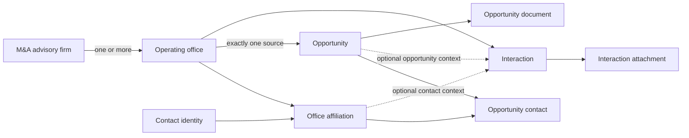

# WAVE M&A Data Model and Dictionary v1

## Contract status

| Item | Value |
| --- | --- |
| Status | Approved target contract |
| Implementation status | Transitional. The live database does not yet implement the operating office model |
| Contract owner | Ivan Paudice, CTO and product owner |
| Implementation owner | Dev team |
| Business reviewers | Bertrand and Colin when a real operating case needs confirmation |
| PDR scope | W-061, M&A office and contact identity foundation; W-062, M&A relationship history |
| Last reviewed against live Supabase | 2026-07-26 |
| Last reviewed against source workbook | 2026-07-26, `CRM Re-New for Wave.xlsx` |

This is the only human-readable source of truth for the M&A advisory data model. Supabase enforces the released implementation. This document defines the approved business meaning, target relationships, requiredness and visibility.

If the released database and this contract disagree, the difference must be made explicit. Do not silently change the document to describe an accidental implementation and do not call a target rule implemented until it is verified in the live database.

Any change to the M&A schema, business validation, visibility rule or import mapping must update this document in the same commit before release.

W-061 core scope is the firm, office, contact affiliation and opportunity source foundation. W-062 core scope is the office-anchored interaction history. Interaction attachments, discovery provenance and geography confidence are valid optional capabilities, but they do not block either core card unless the PDR explicitly brings them into scope.

## Requiredness language

| Label | Meaning |
| --- | --- |
| System | Generated and maintained by WAVE |
| Always | Required when the record is created |
| Valid opportunity | Required before an opportunity may leave `draft` and while it is `active` or `paused` |
| Repreneur visible | Required before an opportunity may be exposed to a repreneur |
| Conditional | Required only when the stated condition is true |
| Optional | May be absent without making the record invalid |

Database `NOT NULL` is not a substitute for this contract. A database field may remain nullable to support drafts or migration staging while still being required at a later business gate.

Closed and archived opportunities preserve the source and contact history that was valid when work occurred. They are not required to keep a currently active affiliation or usable current email.

## Model at a glance

The constant relationship chain is:

`M&A advisory firm → operating office → contacts, opportunities and interactions`

Every non-archived firm has at least one active office. A firm without a known branch structure receives one synthetic default office. A multi-office firm has no fallback office: staff must select the real office. Contacts may work across several offices through affiliations. Opportunities and interactions never attach directly to a firm.

`Network` is optional information on a firm. It is not a separate operational entity in version 1.

## 1. M&A advisory firm

**Purpose:** the stable identity of the M&A advisory business. It is not an office and it does not directly own contacts, opportunities or interactions.

**Target table:** `ma_firms`

| Attribute | Type or values | Requiredness | Visibility | Source of truth | Meaning and validation |
| --- | --- | --- | --- | --- | --- |
| `id` | UUID | System | Staff only | WAVE | Stable internal identity |
| `name` | Text | Always | Staff only | WAVE | Human-readable firm name; trimmed and non-empty |
| `status` | `prospect`, `active`, `archived` | Always | Staff only | WAVE | Defaults to `prospect`; archiving preserves history |
| `category` | Controlled text | Optional | Staff only | WAVE | Examples include M&A boutique, advisory bank and transaction advisory; taxonomy may evolve without changing relationships |
| `network_label` | Text | Optional | Staff only | WAVE | Informational grouping only; it cannot own contacts, opportunities, scoring or workflow |
| `website_url` | URL | Optional | Staff only | WAVE | Firm-level website |
| `discovery_channel` | Controlled text | Optional | Staff only | WAVE | How Re-New first identified the firm |
| `discovery_url` | URL | Optional | Staff only | WAVE | Evidence supporting the discovery channel |
| `discovered_at` | Date | Optional | Staff only | WAVE | Date the firm was added to the source dataset |
| `internal_notes` | Text | Optional | Staff only | WAVE | Relationship context; never exposed to repreneurs |
| `created_by`, `created_at` | Staff ID, timestamp | System | Staff only | WAVE | Creation audit |
| `updated_by`, `updated_at` | Staff ID, timestamp | System | Staff only | WAVE | Last change audit |
| `archived_by`, `archived_at` | Staff ID, timestamp | Conditional | Staff only | WAVE | Required when archived |

### Firm rules

1. Every non-archived firm has at least one active operating office.
2. Creating a firm without a known real office creates one synthetic default office with the same name.
3. A firm may exist as a prospect without contacts or opportunities.
4. A referenced firm is archived, never hard deleted.
5. Firm name similarity may raise a duplicate warning but does not merge records automatically.

## 2. Operating office

**Purpose:** the exact operational location or unit through which Re-New manages contacts, opportunities and interactions.

**Target table:** `ma_offices`

| Attribute | Type or values | Requiredness | Visibility | Source of truth | Meaning and validation |
| --- | --- | --- | --- | --- | --- |
| `id` | UUID | System | Staff only | WAVE | Stable internal identity |
| `firm_id` | UUID | Always | Staff only | WAVE | Exactly one parent firm |
| `name` | Text | Always | Staff only | WAVE | Office name; default office may use the firm name |
| `status` | `active`, `archived` | Always | Staff only | WAVE | Defaults to `active` |
| `is_default` | Boolean | Always | Staff only | WAVE | `true` only for the synthetic office created when no real office is known |
| `city` | Text | Optional | Staff only | WAVE | Main office city |
| `address` | Text | Optional | Staff only | WAVE | Postal address when operationally useful |
| `region_codes` | List of controlled codes | Optional | Staff only | WAVE | Geographic coverage using the canonical WAVE geography taxonomy |
| `coverage_note` | Text | Optional | Staff only | WAVE | Free-text exception or national coverage note |
| `geography_confidence` | `confirmed`, `review` | Conditional | Staff only | WAVE | Used when imported geographic classification needs review |
| `website_url` | URL | Optional | Staff only | WAVE | Office-specific website |
| `general_email` | Email | Optional | Staff only | WAVE | Office mailbox; it is not a person and cannot be an opportunity primary contact |
| `general_phone` | Text | Optional | Staff only | WAVE | Office telephone |
| `internal_notes` | Text | Optional | Staff only | WAVE | Office-specific relationship context |
| `created_by`, `created_at` | Staff ID, timestamp | System | Staff only | WAVE | Creation audit |
| `updated_by`, `updated_at` | Staff ID, timestamp | System | Staff only | WAVE | Last change audit |
| `archived_by`, `archived_at` | Staff ID, timestamp | Conditional | Staff only | WAVE | Required when archived |

### Office rules

1. An office belongs to exactly one firm.
2. At most one synthetic default office may exist for a firm.
3. A multi-office firm has no automatic fallback. Staff must select the real office.
4. When real offices become known, WAVE stops using the synthetic default for new records. Historical links remain until staff resolves any active records.
5. An office with referenced contacts, opportunities or interactions is archived, never hard deleted.
6. Contacts, opportunities and interactions attach to an office, never directly to the firm.

## 3. Contact

**Purpose:** one stable WAVE identity for one person.

**Target table:** `ma_contacts`

| Attribute | Type or values | Requiredness | Visibility | Source of truth | Meaning and validation |
| --- | --- | --- | --- | --- | --- |
| `id` | UUID | System | Staff only | WAVE | Stable person identity |
| `first_name` | Text | Conditional | Staff only | WAVE | At least one of first name or last name is required |
| `last_name` | Text | Conditional | Staff only | WAVE | At least one of first name or last name is required |
| `display_name` | Text | System | Staff only | WAVE | Derived from the available name fields |
| `status` | `active`, `archived` | Always | Staff only | WAVE | Defaults to `active` |
| `email` | Email | Optional | Staff only | WAVE | Normalized for comparison; not globally unique |
| `phone` | Text | Optional | Staff only | WAVE | Normalized for search while preserving the entered display value |
| `linkedin_url` | URL | Optional | Staff only | WAVE | Person-level profile |
| `internal_notes` | Text | Optional | Staff only | WAVE | Person-level relationship context |
| `created_by`, `created_at` | Staff ID, timestamp | System | Staff only | WAVE | Creation audit |
| `updated_by`, `updated_at` | Staff ID, timestamp | System | Staff only | WAVE | Last change audit |
| `archived_by`, `archived_at` | Staff ID, timestamp | Conditional | Staff only | WAVE | Required when archived |

### Contact rules

1. A contact is a person, not a generic office mailbox.
2. An active contact has at least one active office affiliation.
3. The same contact may have several office affiliations without duplicating the person.
4. Email is not globally unique. Repeated email raises a warning for review but does not block a legitimate multi-office relationship.
5. A contact without a usable email may exist, but cannot be the primary contact of a valid opportunity.
6. A referenced contact is archived, never hard deleted.

## 4. Contact office affiliation

**Purpose:** identifies the exact office relationship through which a contact works.

**Target table:** `ma_contact_office_affiliations`

| Attribute | Type or values | Requiredness | Visibility | Source of truth | Meaning and validation |
| --- | --- | --- | --- | --- | --- |
| `id` | UUID | System | Staff only | WAVE | Stable relationship identity |
| `contact_id` | UUID | Always | Staff only | WAVE | One contact |
| `office_id` | UUID | Always | Staff only | WAVE | One operating office |
| `job_title` | Text | Optional | Staff only | WAVE | Role held at this office |
| `is_active` | Boolean | Always | Staff only | WAVE | Defaults to `true` |
| `started_at` | Date | Optional | Staff only | WAVE | Known relationship start |
| `ended_at` | Date | Conditional | Staff only | WAVE | Required when the affiliation becomes inactive |
| `created_by`, `created_at` | Staff ID, timestamp | System | Staff only | WAVE | Creation audit |
| `ended_by`, `updated_at` | Staff ID, timestamp | System | Staff only | WAVE | Change audit |

### Affiliation rules

1. Only one active affiliation may exist for the same contact and office pair.
2. Ending an affiliation preserves every opportunity and interaction that used it.
3. A contact may move offices by ending the old affiliation and creating or activating the new one.
4. An affiliation cannot be deleted while referenced.
5. An affiliation used by an `active` or `paused` opportunity may end only after staff links a replacement at the same office or closes or archives the opportunity.
6. If the ending affiliation is primary, staff must identify the replacement primary contact before operational work can continue.

## 5. Opportunity

**Purpose:** one acquisition opportunity sourced through exactly one operating office.

**Target table:** `opportunities`, evolved additively from the current table.

| Attribute | Type or values | Requiredness | Visibility | Source of truth | Meaning and validation |
| --- | --- | --- | --- | --- | --- |
| `id` | UUID | System | Staff only | WAVE | Stable internal identity |
| `reference` | Text | Always | Staff and repreneur when visible | WAVE | Unique Re-New reference |
| `status` | `draft`, `active`, `paused`, `archived`, `closed` | Always | Role appropriate | WAVE | Defaults to `draft`; leaving draft activates validity rules |
| `source_office_id` | UUID | Valid opportunity | Staff only | WAVE | Exactly one source office |
| `location` | Text | Repreneur visible | Role appropriate | WAVE | Reader-facing location |
| `geography_code` | Controlled code | Optional | Staff only | WAVE | Canonical matching geography |
| `geography_confidence` | `confirmed`, `review` | Conditional | Staff only | WAVE | Required when imported geography needs review |
| `sector` | Controlled label | Repreneur visible | Role appropriate | WAVE | Reader-facing canonical sector |
| `sector_code` | Controlled code | Optional | Staff only | WAVE | Canonical matching sector |
| `sector_confidence` | `confirmed`, `review` | Conditional | Staff only | WAVE | Required when imported sector needs review |
| `description` | Text | Valid opportunity | Staff only | WAVE | Full internal opportunity description |
| `revenue_meur` | Numeric | Optional | Role appropriate | WAVE | Revenue in millions of euros; missing remains `null` |
| `ebitda_keur` | Numeric | Optional | Role appropriate | WAVE | EBITDA in thousands of euros; missing remains `null` |
| `headcount` | Integer | Optional | Role appropriate | WAVE | Exact headcount when known |
| `headcount_range` | Controlled text | Optional | Role appropriate | WAVE | Range when exact headcount is not known |
| `date_added` | Date | Optional | Staff only | WAVE | Source-reported or staff-entered opportunity date; it is not the WAVE creation timestamp |
| `origin_channel` | Controlled text | Optional | Staff only | WAVE | Examples include DealMakr, DealSuite and direct |
| `public_title` | Text | Repreneur visible | Repreneur when visible | WAVE | Anonymized reader-facing title |
| `teaser_summary` | Text | Repreneur visible | Repreneur when visible | WAVE | Approved anonymized summary |
| `repreneur_exposure` | `staff_only`, `anonymized`, `repreneur_visible` | Always | Role appropriate | WAVE | Defaults to `anonymized`; confidentiality rules still govern exposure |
| `internal_notes` | Text | Optional | Staff only | WAVE | Operational notes; never exposed |
| `created_by`, `created_at` | Staff ID, timestamp | System | Staff only | WAVE | Creation audit; `created_at` is when the WAVE record was created |
| `updated_by`, `updated_at` | Staff ID, timestamp | System | Staff only | WAVE | Last change audit |
| `archived_by`, `archived_at` | Staff ID, timestamp | Conditional | Staff only | WAVE | Required when archived |

### Opportunity rules

1. A draft may be incomplete.
2. An opportunity may leave `draft` only when it has a source office, description, at least one named contact, exactly one primary contact and a usable email for that primary contact.
3. Every active opportunity contact must use an active affiliation with the opportunity's source office.
4. A repreneur-visible opportunity additionally requires location, sector, public title, teaser summary and the existing confidentiality gates.
5. Source firm, source office, source contacts, relationship history and internal notes remain staff only at every stage.
6. Missing financial values remain `null`. Matching may apply a zero-equivalent only inside scoring and must flag incomplete inputs.
7. The source name shown in staff views is derived through the office and firm relationship. It is not stored as a second source relationship.
8. A positioned repreneur is represented by the existing match and pursuit objects, never by free text on the opportunity.
9. If an `active` or `paused` opportunity loses its usable primary contact email, WAVE flags a blocking validity issue. Staff must correct the email, select another primary contact or close or archive the opportunity before further workflow or new repreneur exposure.
10. Closing or archiving an opportunity preserves its historical source office and contact links even when those contacts later move or become inactive.

## 6. Opportunity contact

**Purpose:** links an opportunity to a contact through the exact office affiliation relevant to that opportunity.

**Target table:** `opportunity_ma_contacts`

| Attribute | Type or values | Requiredness | Visibility | Source of truth | Meaning and validation |
| --- | --- | --- | --- | --- | --- |
| `id` | UUID | System | Staff only | WAVE | Stable relationship identity |
| `opportunity_id` | UUID | Always | Staff only | WAVE | One opportunity |
| `affiliation_id` | UUID | Always | Staff only | WAVE | Exact contact and office relationship |
| `is_primary` | Boolean | Always | Staff only | WAVE | Exactly one active link is primary for a valid opportunity |
| `is_active` | Boolean | Always | Staff only | WAVE | Defaults to `true` |
| `linked_by`, `linked_at` | Staff ID, timestamp | System | Staff only | WAVE | Creation audit |
| `removed_by`, `removed_at` | Staff ID, timestamp | Conditional | Staff only | WAVE | Required when the link becomes inactive |

### Opportunity contact rules

1. The affiliation office must equal the opportunity source office.
2. A valid opportunity has one or more active contact links and exactly one primary.
3. The primary contact must be named and have a usable email.
4. Removing a contact link ends it. Historical attribution is preserved.
5. No role taxonomy beyond primary versus additional is introduced in version 1.

## 7. Interaction

**Purpose:** records the M&A relationship history before, during or after a specific opportunity.

**Target table:** `ma_interactions`

| Attribute | Type or values | Requiredness | Visibility | Source of truth | Meaning and validation |
| --- | --- | --- | --- | --- | --- |
| `id` | UUID | System | Staff only | WAVE | Stable interaction identity |
| `office_id` | UUID | Always | Staff only | WAVE | Exact operating office context |
| `affiliation_id` | UUID | Optional | Staff only | WAVE | Contact and office relationship when a person is involved |
| `opportunity_id` | UUID | Optional | Staff only | WAVE | Related opportunity; not required |
| `channel` | `call`, `email`, `meeting`, `document`, `other` | Always | Staff only | WAVE | Interaction type |
| `direction` | `inbound`, `outbound` | Conditional | Staff only | WAVE | Required for email and call; optional for other channels |
| `occurred_at` | Timestamp | Always | Staff only | WAVE | When the interaction happened |
| `owner_staff_user_id` | Staff ID | Always | Staff only | WAVE | Staff member responsible for the interaction |
| `title` | Text | Optional | Staff only | WAVE | Short label or email subject |
| `summary` | Text | Conditional | Staff only | WAVE | Required unless at least one attachment or stored email body provides the evidence |
| `outcome` | Text | Optional | Staff only | WAVE | Result of the interaction |
| `next_action` | Text | Optional | Staff only | WAVE | Concrete follow-up |
| `next_action_due_at` | Timestamp | Conditional | Staff only | WAVE | Required when a dated next action is committed |
| `template_key` | Text | Conditional | Staff only | WAVE | Required only for an email created from a WAVE template |
| `recipient_email_snapshot` | Email | Conditional | Staff only | WAVE | Required for an outbound email; preserves what was actually used |
| `body_markdown` | Text | Optional | Staff only | WAVE | Stored email body or structured notes |
| `delivery_status` | `pending`, `sent`, `failed` | Conditional | Staff only | WAVE | Required for email delivery attempts |
| `delivery_error` | Text | Conditional | Staff only | WAVE | Required when email delivery fails |
| `sent_at` | Timestamp | Conditional | Staff only | WAVE | Required when an email is sent |
| `created_by`, `created_at` | Staff ID, timestamp | System | Staff only | WAVE | Creation audit |
| `updated_by`, `updated_at` | Staff ID, timestamp | System | Staff only | WAVE | Correction audit |

### Interaction rules

1. An interaction always belongs to an office.
2. A contact is optional. When present, its affiliation must belong to the same office.
3. An opportunity is optional. When present, its source office must equal the interaction office.
4. An interaction can exist before an opportunity.
5. Interactions are staff only and remain in chronological history.
6. A sent email preserves recipient, subject and body evidence even if the contact later changes email.
7. Corrections are audited. Interactions are not silently overwritten or hard deleted.

## 8. Interaction attachment

**Purpose:** stores a document received, sent or discussed in an interaction that may exist without an opportunity.

**Target table:** `ma_interaction_attachments`

| Attribute | Type or values | Requiredness | Visibility | Source of truth | Meaning and validation |
| --- | --- | --- | --- | --- | --- |
| `id` | UUID | System | Staff only | WAVE | Stable attachment identity |
| `interaction_id` | UUID | Always | Staff only | WAVE | Parent interaction |
| `title` | Text | Always | Staff only | WAVE | Human-readable label |
| `storage_bucket` | Text | Always | Staff only | WAVE | Private storage bucket |
| `storage_path` | Text | Always | Staff only | WAVE | Private object path |
| `file_name` | Text | Always | Staff only | WAVE | Original display name |
| `mime_type` | Text | Optional | Staff only | WAVE | File content type |
| `size_bytes` | Integer | Optional | Staff only | WAVE | File size |
| `uploaded_by`, `uploaded_at` | Staff ID, timestamp | System | Staff only | WAVE | Upload audit |

### Attachment rules

1. Interaction attachments are staff only.
2. Linking an interaction to an opportunity does not expose its attachment to a repreneur.
3. A file becomes an opportunity document only through an explicit staff action and the opportunity document visibility rules.

## 9. Opportunity document

**Purpose:** stores deal documents associated with an opportunity and their controlled visibility.

**Target table:** `opportunity_documents`, retaining the current table.

| Attribute | Type or values | Requiredness | Visibility | Source of truth | Meaning and validation |
| --- | --- | --- | --- | --- | --- |
| `id` | UUID | System | Staff only | WAVE | Stable document identity |
| `opportunity_id` | UUID | Always | Staff only | WAVE | Parent opportunity |
| `title` | Text | Always | Role appropriate | WAVE | Human-readable title |
| `document_type` | `teaser`, `deal_book`, `nda`, `external_analysis`, `other` | Always | Role appropriate | WAVE | Controlled document category |
| `visibility` | `staff_only`, `approved_for_repreneur` | Always | Role appropriate | WAVE | Defaults to `staff_only`; existing confidentiality gates still apply |
| `storage_bucket` | Text | Always | Staff only | WAVE | Private storage bucket |
| `storage_path` | Text | Conditional | Staff only | WAVE | Required unless an external URL is used |
| `external_url` | URL | Conditional | Staff only | WAVE | Required unless a storage path is used |
| `file_name`, `mime_type`, `size_bytes` | Text, text, integer | Optional | Staff only | WAVE | File metadata |
| `uploaded_by`, `uploaded_at` | Staff ID, timestamp | System | Staff only | WAVE | Upload audit |
| `repreneur_approved_by`, `repreneur_approved_at` | Staff ID, timestamp | Conditional | Staff only | WAVE | Required when visibility becomes `approved_for_repreneur` |
| `updated_at` | Timestamp | System | Staff only | WAVE | Last metadata change |

### Opportunity document rules

1. A document defaults to `staff_only`.
2. `approved_for_repreneur` requires a recorded approving staff member and timestamp.
3. Delivery to a repreneur additionally requires the existing signed or explicitly waived NDA evidence. Visibility alone is never sufficient.
4. Browser roles never receive direct database or storage access to staff-only source and document records. Approved delivery uses the existing server-side confidentiality path.

## Cross-entity invariants

These rules are part of the contract and should be enforced in the database wherever practical:

1. Every non-archived firm has one or more active offices. A firm may have at most one synthetic default office, and only while no real office is known.
2. Contacts reach offices only through affiliations.
3. Opportunities and interactions always anchor to an office.
4. An opportunity contact links through an affiliation belonging to the opportunity source office.
5. A valid opportunity has at least one active contact and exactly one primary contact.
6. The primary contact of a valid opportunity is named and has a usable email.
7. An interaction's optional contact and opportunity must belong to the interaction office.
8. Referenced firms, offices, contacts and relationships are archived or end-dated, never hard deleted.
9. Every staff mutation records actor and timestamp.
10. Source relationships, interactions and internal notes are staff only.
11. Excel identifiers never remain in live firm, office, contact or opportunity records.

## Repreneur visibility contract

| Data | Staff | Repreneur |
| --- | --- | --- |
| Firm, office and contact identities | Yes | Never |
| Firm, office and contact notes | Yes | Never |
| Interaction history and attachments | Yes | Never |
| Opportunity internal description and notes | Yes | Never |
| Opportunity public title, teaser, sector, location and approved metrics | Yes | Only when the opportunity visibility and confidentiality gates allow it |
| Opportunity documents | Yes | Only when explicitly approved and the NDA gate allows it |
| Cutover mappings and issues | Yes | Never |

No API, export, notification, download or UI surface may expose staff-only source information to a repreneur.

## Source workbook mapping

The cutover mapper uses the workbook structure as input. The workbook does not define the WAVE architecture.

### One-time cutover rules

1. Excel remains operationally authoritative until Ivan announces the production switch. WAVE data remains test data until then.
2. There is one production cutover import. A revised workbook before approval replaces the pending input; it does not create a recurring sync.
3. Source rows and temporary mappings are staged outside the live domain tables. Missing or conflicting information is never invented.
4. An incomplete opportunity remains an import exception until it has a source office, description, named primary contact and usable primary email.
5. Duplicate candidates are reviewed before activation. Missing financial values remain `null`.
6. After row counts and relationships reconcile and Ivan approves the migration, temporary rows and every source workbook ID are deleted. Live records retain only WAVE IDs.
7. Keep a cutover manifest with source file name, execution time, responsible staff member, record totals and exception decisions. The manifest is migration evidence, not another business entity or recurring import system.
8. A cell containing several email addresses is never imported as one address:
   1. If the addresses belong to one named person, staff verifies one usable primary email. Other addresses remain in the cutover resolution note unless a future contact-method model is approved.
   2. If the addresses belong to different people, split them into separate contacts.
   3. If ownership is unclear or an address is malformed, keep the row as an exception.

### Firm and office rows

| Source meaning | WAVE target | Rule |
| --- | --- | --- |
| Firm and office worksheet, column A | Temporary source row ID | Maps each source row during cutover only; delete after approval |
| Firm and office worksheet, parent ID column | Temporary parent mapping | Resolves the source row to its parent firm; delete after approval |
| Firm and office worksheet, level column | Cutover classification | Distinguishes firm and office rows; do not retain it as a second hierarchy |
| Firm or office name | `ma_firms.name` or `ma_offices.name` | Parent and level columns determine the split during staging |
| Optional network label | `ma_firms.network_label` | Informational only |
| Firm category | `ma_firms.category` | Optional controlled value |
| Region and geography confidence | `ma_offices.region_codes`, `geography_confidence` | Review non-confirmed values |
| Website | Firm or office website | Use the most specific valid level |
| Discovery source, evidence link and date | Firm provenance fields | Optional; never a cutover blocker |

### Contact rows

| Source meaning | WAVE target | Rule |
| --- | --- | --- |
| Contacts worksheet, column A | Temporary source office ID | Maps to `office_id` during cutover only; delete after approval |
| First and last name | `ma_contacts` | At least one name component required |
| Job title | Affiliation `job_title` | Office-specific |
| Managed offices | Additional affiliations | Split and validate each office |
| Email, phone and LinkedIn | `ma_contacts` | Email is not globally unique; apply the multi-email exception rules above |
| Repeated firm website and region | Derived from office | Do not duplicate on the contact |

### Opportunity rows

| Source meaning | WAVE target | Rule |
| --- | --- | --- |
| Mandate reference | `opportunities.reference` | Required and unique |
| Opportunities worksheet, column B | Temporary source office ID | Maps to `source_office_id`; required before activation and deleted after cutover |
| Source name | Validation evidence | Do not retain a duplicate source relationship |
| Location, geography code and confidence | Opportunity geography fields | Review non-confirmed classifications |
| Sector, sector code and confidence | Opportunity sector fields | Review non-confirmed classifications |
| Description | `opportunities.description` | Required before activation |
| Revenue, EBITDA and headcount | Opportunity metrics | Missing remains `null` |
| Date added | `opportunities.date_added` | Optional source-reported business date; WAVE `created_at` records system creation |
| Origin channel | `opportunities.origin_channel` | Optional |
| Platform title | `opportunities.public_title` | Required before repreneur visibility |
| Positioned repreneur | Existing match or pursuit | Never store as free text on the opportunity |
| Associated contact email | Temporary contact matching evidence | Convert to an affiliation and opportunity contact; do not retain as the relationship |
| Notes | `opportunities.internal_notes` | Staff only |

## Current implementation reconciliation

Verified against the live Supabase schema and checked-in migrations 072 to 075 on 2026-07-26. Update this table after each released migration.

### Reproducible verification

Run `scripts/verify-ma-data-model-schema.sql` through the configured read-only Supabase connection against production project `iiuqcdnmxhtyispnykgf` before changing this section. The script performs these checks:

1. Read `information_schema.columns` for `ma_source_networks`, `ma_sources`, `ma_source_contacts`, `ma_source_contact_moves`, `ma_source_interactions`, `opportunities`, `opportunity_source_contacts` and `opportunity_documents`.
2. Read `pg_constraint` for their primary, foreign-key, unique and check constraints.
3. Read `pg_indexes` for their unique and partial indexes.
4. Compare the result with checked-in migrations, TypeScript types and this target contract.
5. Record the verification date above only after all four checks.

| Current live and checked-in object | Current behavior | Target disposition | Status |
| --- | --- | --- | --- |
| `ma_sources` | Interim firm-level source record. Embedded contact fields are deprecated compatibility fields after migration 072 | Split into firm and office; remove embedded contact fields after compatibility | Implemented interim model; target gap, W-061 |
| `ma_source_networks` | Migration 074 and current staff UI create an optional grouping object for firms | Freeze it as compatibility grouping only. It cannot own workflow, scoring, reporting, contacts or opportunities. Collapse it to optional firm `network_label` in W-061 unless a real operating use case is approved | Current divergence; resolve in W-061 |
| `ma_source_contacts` | Migration 072 supports several contacts per firm-level source; migration 075 allows a contact record to move between sources | Migrate to one contact identity plus one or more office affiliations | Implemented interim model; target gap, W-061 |
| `ma_source_contact_moves` | Migration 075 keeps append-only old and new source and contact details | Supersede with end-dated office affiliation history while preserving the audit | Implemented interim model; target gap, W-061 |
| `opportunities.source_id` | Nullable for drafts and historical rows. Migration 073 requires a firm-level source for new or updated `active` opportunities only | Replace additively with `source_office_id`; enforce source, description, named primary contact and usable email for `active` and `paused` opportunities | Partial at firm level; target gap, W-061 |
| `opportunity_source_contacts` | Migrations 072 and 075 support several contacts, at most one primary, source consistency and immutable contact snapshots after moves | Link through office affiliation and enforce at least one contact plus exactly one primary for valid opportunities | Partial; office affiliation and full validity remain W-061 |
| `ma_source_interactions` | Opportunity remains required and history remains email-oriented. Migration 072 adds an optional contact link and preserves recipient evidence | Office required; contact and opportunity optional; support call, email, meeting and document | Partial contact linkage; target gap, W-062 |
| `opportunity_documents` | Migration 073 adds staff approval evidence, NDA evidence checks and service-role-only browser access | Retain the current confidentiality wall and keep opportunity documents separate from staff-only relationship attachments | Implemented and live verified |

### Current field disposition

| Current field or group | Target disposition |
| --- | --- |
| `opportunities.activity` | Compatibility display only for existing data. Merge useful meaning into canonical sector or description during W-061, then remove |
| `opportunities.date_added` | Retain as the optional source-reported or staff-entered business date; do not confuse it with `created_at` |
| `opportunities.source_label` | Derive the staff display label through office and firm during compatibility, then remove the stored duplicate |
| `opportunities.imported_from`, `opportunities.imported_at` | Replace with the one-time cutover manifest and remove from live opportunity records after migration |
| Duplicate opportunity visibility fields | Consolidate on the existing canonical exposure and confidentiality rules before removing compatibility fields |
| `ma_sources.contact_name`, `contact_email`, `contact_phone` | Deprecated compatibility fields. Read them only for migration fallback, then remove after the office backfill and compatibility period |
| `ma_sources.network_id`, `ma_source_networks` | Interim grouping only. Collapse to optional `ma_firms.network_label` if the target contract remains unchanged |
| `ma_source_contacts.source_id`, `opportunity_source_contacts.source_id` | Interim firm-level relationships. Replace with office affiliations and office-anchored opportunity contacts in W-061 |
| `opportunity_source_contacts.contact_name_snapshot`, `contact_email_snapshot`, `contact_phone_snapshot` | Preserve as historical attribution when migrating the opportunity-contact relationship |
| `ma_source_interactions.template_key` | Retain as optional template provenance for generated emails |
| `ma_source_interactions.channel`, `direction` | Retain and expand under the interaction contract |
| `ma_source_interactions.contact_id` | Interim contact link. Migrate to `affiliation_id` while preserving the contact and recipient snapshot |
| `ma_source_interactions.recipient_email`, `subject`, `body_markdown` | Map to recipient snapshot, title and body while preserving sent evidence |
| `ma_source_interactions.status`, `error_message`, `sent_at` | Map to delivery status, delivery error and sent timestamp |
| `opportunity_documents.repreneur_approved_by`, `repreneur_approved_at` | Retain as required disclosure evidence when a document is approved for repreneur access |

The checked-in baseline now represents the current flat firm-level source model, multiple contacts, network grouping, contact moves and confidentiality wall. W-061 is the additive migration from that interim implementation to the target firm, office and affiliation model. Do not roll back current history or confidentiality controls.

## Change protocol

### What triggers an update

Update this document when any change affects:

1. An entity, attribute, type or allowed value.
2. Requiredness or lifecycle validation.
3. Cardinality, ownership, archival or deletion behavior.
4. Staff or repreneur visibility.
5. Import mapping, exception handling or data retention.
6. The implemented status of a target rule.

Ordinary corrections to record values do not change this contract.

### Required sequence

1. Update this contract before or with the implementation.
2. Record the business reason in the change log.
3. Update the migration, TypeScript types, application validation and tests together.
4. Keep the migration additive until the new structure is live and backfilled.
5. Verify the released schema and role behavior.
6. Update the implementation reconciliation table only after verification.

### Approval

Ivan approves changes to requiredness, relationships, visibility and retention. The Dev team may update implementation status and technical names when the approved business meaning does not change. Bertrand and Colin provide operating evidence when an exception could justify a model change.

### Versioning

| Change | Version |
| --- | --- |
| Wording, examples or implementation status only | Patch |
| New optional field or backward-compatible rule | Minor |
| Changed relationship, requiredness, visibility or retention | Major |

Do not create a parallel M&A data model document. Link to this file instead.

## Change log

| Date | Version | Change | PDR or implementation reference |
| --- | --- | --- | --- |
| 2026-07-26 | 1.0 | Created the approved office-centred target contract, field dictionary, cutover mapping and maintenance rules; reconciled it with the interim implementation | W-061, W-062 and migrations 072 to 075 |
